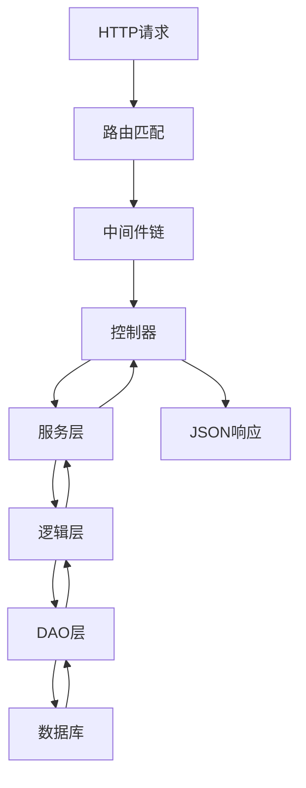
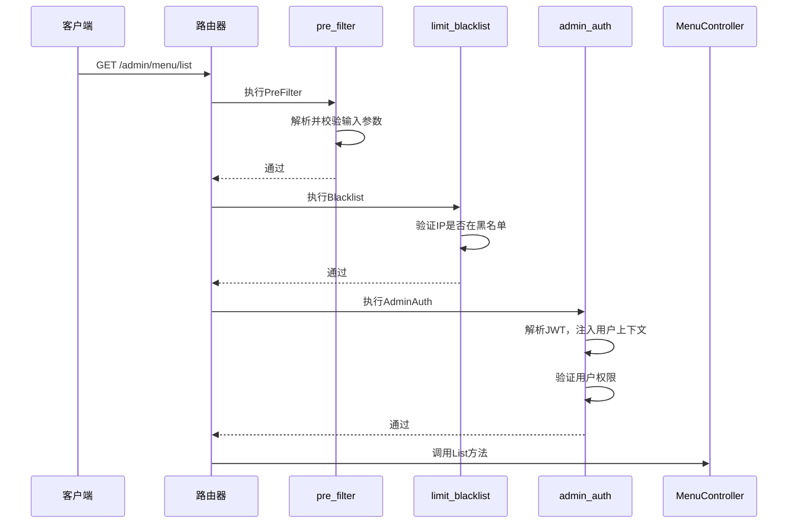

# 请求处理全流程

<cite>
**本文档引用的文件**
- [admin.go](file://server/internal/router/admin.go)
- [pre_filter.go](file://server/internal/logic/middleware/pre_filter.go)
- [limit_blacklist.go](file://server/internal/logic/middleware/limit_blacklist.go)
- [admin_auth.go](file://server/internal/logic/middleware/admin_auth.go)
- [menu.go](file://server/internal/controller/admin/admin/menu.go)
- [menu.go](file://server/internal/logic/admin/menu.go)
- [sys.go](file://server/internal/service/sys.go)
- [admin_menu.go](file://server/internal/dao/admin_menu.go)
- [context.go](file://server/internal/library/contexts/context.go)
</cite>

## 目录
1. [简介](#简介)
2. [请求处理流程概览](#请求处理流程概览)
3. [路由匹配](#路由匹配)
4. [中间件链处理](#中间件链处理)
5. [控制器与业务逻辑](#控制器与业务逻辑)
6. [数据访问层](#数据访问层)
7. 上下文传递与`context.Context`
8. [调试与问题排查](#调试与问题排查)
9. [总结](#总结)

## 简介
本文档详细描述了在HotGo框架中，一个HTTP请求从进入系统到最终响应的完整生命周期。以`GET /admin/menu/list`请求为例，我们将追踪其从路由注册、中间件处理、进入控制器、调用服务、执行业务逻辑，再到数据访问层访问数据库，最后将数据封装成JSON响应的每一步。同时，我们将解释`context.Context`在贯穿整个请求链路中的作用，并提供实用的调试和问题排查方法。

## 请求处理流程概览
一个HTTP请求在HotGo系统中的处理流程遵循典型的MVC（Model-View-Controller）模式，并通过中间件链进行预处理和权限控制。整个流程可以概括为以下几个关键阶段：
1.  **路由匹配 (Routing)**: 请求首先到达`router`，根据URL路径匹配到具体的控制器。
2.  **中间件处理 (Middleware Processing)**: 匹配后，请求会依次通过一系列中间件，如`pre_filter`（预处理）、`limit_blacklist`（黑名单拦截）、`admin_auth`（JWT与权限认证）等。
3.  **控制器调用 (Controller Invocation)**: 通过所有中间件后，请求被分发到对应的控制器方法。
4.  **服务与逻辑层 (Service & Logic Layer)**: 控制器调用`SysService`，进而执行`Logic`层的业务逻辑。
5.  **数据访问 (Data Access)**: 业务逻辑层通过`DAO`（Data Access Object）访问数据库。
6.  **响应生成 (Response Generation)**: 数据库操作完成后，数据被逐层返回，最终由控制器封装成JSON格式的响应。



**Diagram sources**
- [admin.go](file://server/internal/router/admin.go#L1-L73)
- [menu.go](file://server/internal/controller/admin/admin/menu.go#L1-L37)

## 路由匹配
请求的旅程始于`server/internal/router/admin.go`文件中的`Admin`函数。该函数定义了后台管理系统的路由组。当一个`GET /admin/menu/list`请求到达时，Gf框架的HTTP服务器会根据路径`/admin/menu/list`查找匹配的路由。

在`admin.go`中，我们看到`group.Bind(common.Site, ...)`和`group.Bind(..., admin.Menu, ...)`的调用。这里的`admin.Menu`是一个控制器实例，它绑定了所有与菜单相关的路由。`Bind`方法会自动扫描控制器中定义的方法，并根据方法名和HTTP动词（如`List`对应`GET`）来注册具体的路由。

**Section sources**
- [admin.go](file://server/internal/router/admin.go#L1-L73)

## 中间件链处理
在请求被分发到`MenuController`之前，它必须通过在`admin.go`中注册的中间件链。这些中间件按顺序执行，形成一个处理管道。

1.  **`pre_filter` (预处理)**: 位于`server/internal/logic/middleware/pre_filter.go`。此中间件负责请求参数的预处理和验证。它会检查请求的输入结构体（如`*menu.ListReq`）是否实现了`validate.Filter`接口。如果实现了，它会调用`validate.PreFilter`方法对输入数据进行过滤和校验。如果校验失败，会立即返回错误响应，阻止请求继续向下传递。
2.  **`limit_blacklist` (黑名单拦截)**: 位于`server/internal/logic/middleware/limit_blacklist.go`。此中间件调用`service.SysBlacklist().VerifyRequest(r)`来检查请求的IP地址是否在黑名单中。如果存在，会返回一个“访问被拒绝”的错误响应。
3.  **`admin_auth` (JWT与权限认证)**: 位于`server/internal/logic/middleware/admin_auth.go`。这是后台鉴权的核心中间件。它首先检查请求路径是否在免登录白名单中（如登录接口）。如果不是，则调用`s.DeliverUserContext(r)`方法，该方法会解析请求头中的JWT令牌，验证其有效性，并将用户信息（如用户ID、角色ID）注入到`context.Context`中。随后，它会检查该用户是否有权限访问当前的路由和HTTP方法，通过调用`service.AdminRole().Verify(ctx, path, r.Method)`来实现。如果权限不足，会返回“你没有访问权限！”的错误。



**Diagram sources**
- [pre_filter.go](file://server/internal/logic/middleware/pre_filter.go#L1-L66)
- [limit_blacklist.go](file://server/internal/logic/middleware/limit_blacklist.go#L1-L21)
- [admin_auth.go](file://server/internal/logic/middleware/admin_auth.go#L1-L53)
- [menu.go](file://server/internal/controller/admin/admin/menu.go#L1-L37)

## 控制器与业务逻辑
一旦请求通过了所有中间件，它就会被分发到`server/internal/controller/admin/admin/menu.go`中的`cMenu.List`方法。

```go
func (c *cMenu) List(ctx context.Context, req *menu.ListReq) (res menu.ListRes, err error) {
    res.MenuListModel, err = service.AdminMenu().List(ctx, &req.MenuListInp)
    return
}
```

控制器的职责非常简单：它接收来自中间件的`context.Context`和经过预处理的请求对象`req`，然后调用`service.AdminMenu()`服务接口的`List`方法，并将结果封装到响应对象`res`中。控制器不包含任何业务逻辑，它只是一个协调者。

业务逻辑的实现位于`server/internal/logic/admin/menu.go`中的`sAdminMenu.List`方法。该方法使用`dao.AdminMenu`查询数据库，获取所有菜单数据，并将其组织成一个树形结构返回。

**Section sources**
- [menu.go](file://server/internal/controller/admin/admin/menu.go#L1-L37)
- [menu.go](file://server/internal/logic/admin/menu.go#L1-L307)

## 数据访问层
`Logic`层通过`DAO`（Data Access Object）来访问数据库。在`menu.go`的`List`方法中，我们可以看到`dao.AdminMenu.Ctx(ctx).Order("sort asc,id desc").Scan(&models)`的调用。

`dao.AdminMenu`是一个全局变量，定义在`server/internal/dao/admin_menu.go`中。它实际上是`internal.AdminMenuDao`的一个实例，提供了对`hg_admin_menu`表的所有数据库操作方法。`Ctx(ctx)`方法将`context.Context`传递给DAO，确保数据库操作与当前请求的上下文相关联。

**Section sources**
- [menu.go](file://server/internal/logic/admin/menu.go#L1-L307)
- [admin_menu.go](file://server/internal/dao/admin_menu.go#L1-L22)

## 上下文传递与`context.Context`
`context.Context`是贯穿整个请求生命周期的核心。它是一个携带截止时间、取消信号和请求范围值的键值对数据结构。

在本例中，`context.Context`的作用至关重要：
1.  **用户信息传递**: `admin_auth`中间件在成功验证JWT后，会将用户信息（如`memberId`、`roleId`）存储在`context.Context`中。后续的`Logic`层和`DAO`层可以通过`contexts.GetRoleId(ctx)`等方法安全地获取这些信息，用于数据权限控制。
2.  **请求跟踪**: `context.Context`可以携带一个唯一的请求ID，用于在日志中关联同一个请求的所有操作，便于调试和追踪。
3.  **超时控制**: 可以设置`context.Context`的超时时间，如果数据库查询或外部服务调用耗时过长，`context`会发出取消信号，防止请求无限期挂起。

`context.Context`通过函数参数从`Controller`一直传递到`DAO`，确保了整个调用链的上下文一致性。

**Section sources**
- [admin_auth.go](file://server/internal/logic/middleware/admin_auth.go#L1-L53)
- [context.go](file://server/internal/library/contexts/context.go#L1-L100)

## 调试与问题排查
当请求出现问题时，可以按照以下步骤进行排查：

1.  **检查路由**: 确认请求的URL路径是否正确，是否与`admin.go`中注册的路由匹配。
2.  **查看中间件日志**: 检查`pre_filter`、`limit_blacklist`、`admin_auth`中间件的日志输出。如果请求在某个中间件被拦截，日志会明确指出原因（如参数校验失败、IP被封禁、权限不足）。
3.  **验证JWT令牌**: 确保请求头中包含了有效的JWT令牌。可以使用在线工具解码令牌，检查其`exp`（过期时间）和`payload`（负载）是否正确。
4.  **检查数据库连接**: 如果问题出现在`DAO`层，检查数据库连接配置和网络是否正常。
5.  **使用`g.Log()`**: 在`Logic`层和`DAO`层的关键位置添加`g.Log().Debugf(ctx, ...)`日志，打印变量值和执行流程，帮助定位问题。

**Section sources**
- [admin.go](file://server/internal/router/admin.go#L1-L73)
- [pre_filter.go](file://server/internal/logic/middleware/pre_filter.go#L1-L66)
- [admin_auth.go](file://server/internal/logic/middleware/admin_auth.go#L1-L53)
- [menu.go](file://server/internal/logic/admin/menu.go#L1-L307)

## 总结
本文档详细剖析了`GET /admin/menu/list`请求在HotGo系统中的完整处理流程。从路由匹配开始，请求依次通过`pre_filter`、`limit_blacklist`和`admin_auth`等中间件进行预处理、安全检查和权限认证。通过认证后，请求被分发到`MenuController`，由其调用`AdminMenu`服务执行业务逻辑。业务逻辑层通过`DAO`访问数据库获取菜单数据，并最终将结果返回给客户端。`context.Context`作为贯穿整个流程的“信使”，确保了用户信息、请求ID和取消信号能够在各层之间安全、高效地传递。理解这一流程对于开发和维护基于HotGo的应用至关重要。