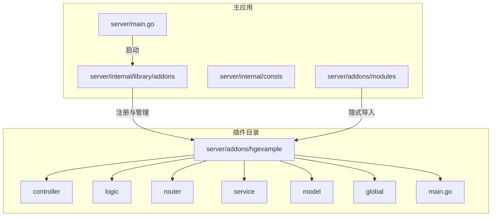
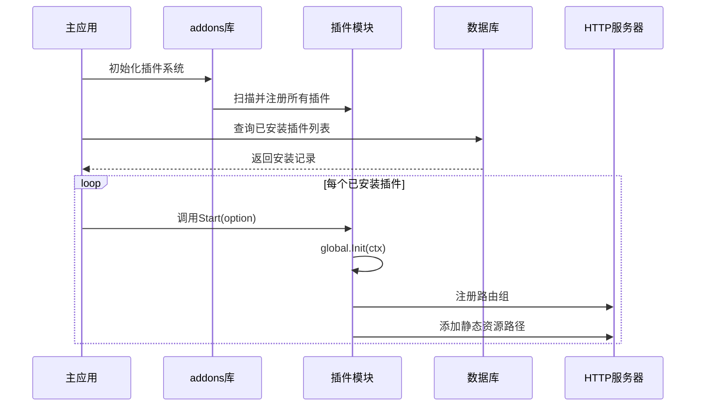
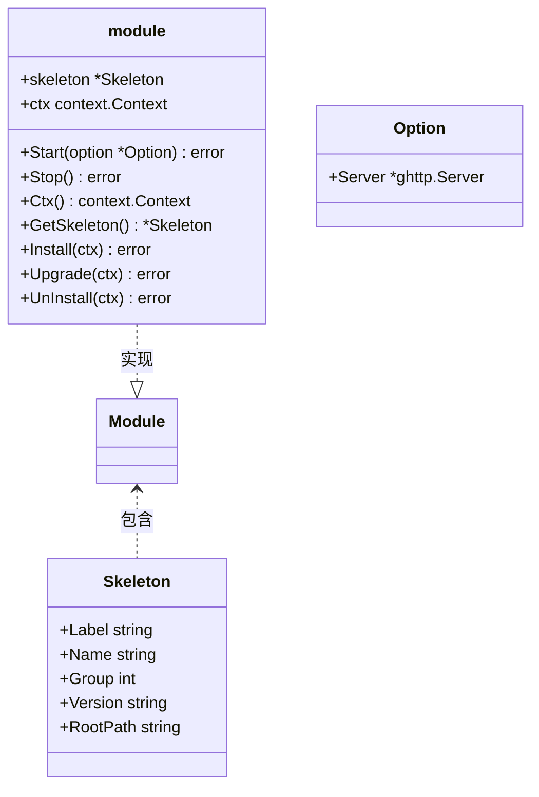
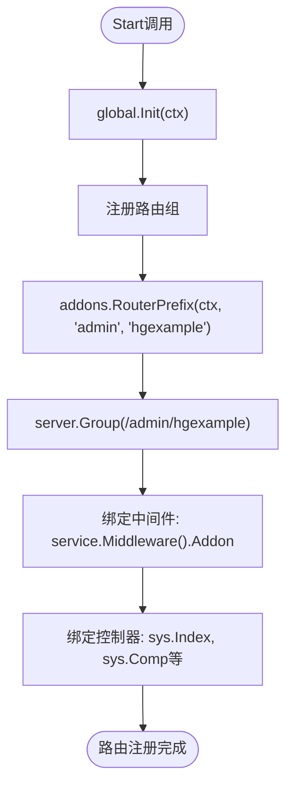
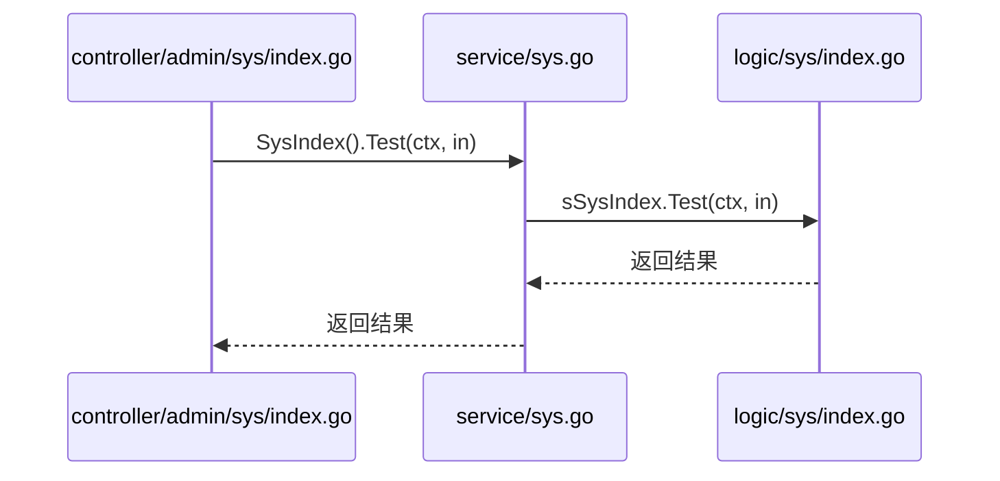
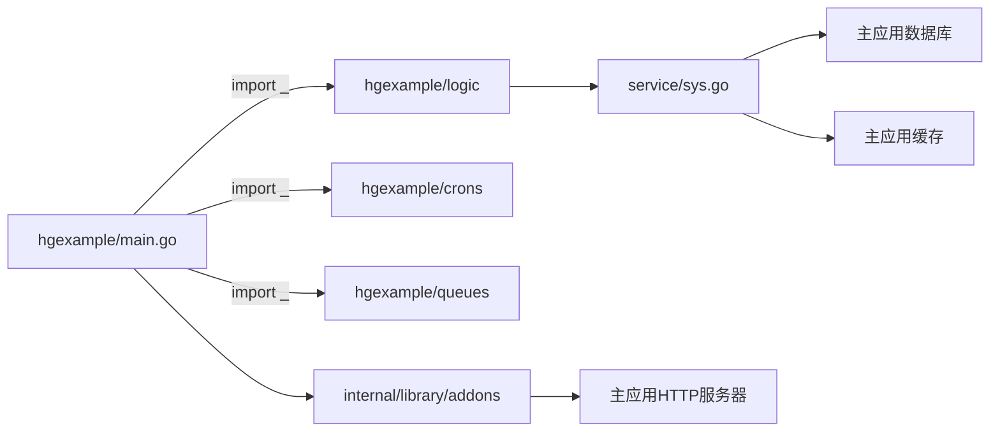

# 插件化架构

<cite>
**本文档引用文件**  
- [addons.go](file://server/addons/addons.go)
- [hgexample/main.go](file://server/addons/hgexample/main.go)
- [hgexample/router/admin.go](file://server/addons/hgexample/router/admin.go)
- [hgexample/controller/admin/sys/index.go](file://server/addons/hgexample/controller/admin/sys/index.go)
- [hgexample/logic/sys/index.go](file://server/addons/hgexample/logic/sys/index.go)
- [hgexample/service/sys.go](file://server/addons/hgexample/service/sys.go)
- [hgexample/model/input/sysin/index.go](file://server/addons/hgexample/model/input/sysin/index.go)
- [modules/hgexample.go](file://server/addons/modules/hgexample.go)
- [internal/library/addons/addons.go](file://server/internal/library/addons/addons.go)
- [internal/library/addons/module.go](file://server/internal/library/addons/module.go)
- [internal/library/addons/install.go](file://server/internal/library/addons/install.go)
- [internal/library/addons/build.go](file://server/internal/library/addons/build.go)
- [internal/consts/addons.go](file://server/internal/consts/addons.go)
</cite>

## 目录
1. [简介](#简介)
2. [项目结构](#项目结构)
3. [核心组件](#核心组件)
4. [架构概述](#架构概述)
5. [详细组件分析](#详细组件分析)
6. [依赖分析](#依赖分析)
7. [性能考虑](#性能考虑)
8. [故障排除指南](#故障排除指南)
9. [结论](#结论)

## 简介
本项目采用插件化架构设计，通过 `addons` 机制实现功能的热插拔与模块化扩展。系统允许开发者以独立插件形式开发新功能，并在不重启主应用的情况下动态加载、安装、卸载和更新。`hgexample` 插件作为示例，展示了完整的插件开发范式，包括控制器、业务逻辑、路由注册、配置管理及生命周期钩子。该架构提升了系统的可维护性、灵活性和可扩展性，适用于需要频繁迭代或按需启用功能的复杂应用场景。

## 项目结构
项目采用清晰的分层与模块化组织方式，主应用与插件代码分离，便于独立开发与维护。

**图示来源**  
- [server/addons](file://server/addons)
- [server/internal/library/addons](file://server/internal/library/addons)

## 核心组件
系统的核心在于 `internal/library/addons` 包提供的插件管理能力，包括插件的构建、安装、注册、路由注入与资源映射。`addons.go` 提供基础路径与资源管理，`module.go` 定义插件接口与生命周期，`install.go` 处理持久化状态，`build.go` 支持插件脚手架生成。`hgexample` 插件作为典型实例，完整实现了从定义骨架、注册模块、绑定路由到提供服务的全过程。

**本节来源**  
- [internal/library/addons/addons.go](file://server/internal/library/addons/addons.go#L1-L61)
- [internal/library/addons/module.go](file://server/internal/library/addons/module.go#L1-L186)
- [internal/library/addons/install.go](file://server/internal/library/addons/install.go#L1-L120)
- [internal/library/addons/build.go](file://server/internal/library/addons/build.go#L1-L138)
- [addons/hgexample/main.go](file://server/addons/hgexample/main.go#L1-L97)

## 架构概述
系统通过接口抽象与依赖注入实现插件化。每个插件实现 `Module` 接口，包含启动、停止、安装等生命周期方法。主应用在初始化时扫描并注册所有插件，根据数据库记录判断其安装状态，并在运行时动态加载已安装插件的路由与静态资源。

**图示来源**  
- [internal/library/addons/module.go](file://server/internal/library/addons/module.go#L139-L156)
- [addons/hgexample/main.go](file://server/addons/hgexample/main.go#L50-L65)
- [internal/library/addons/addons.go](file://server/internal/library/addons/addons.go#L45-L61)

## 详细组件分析

### hgexample插件分析
`hgexample` 插件是系统内置的功能示例，用于演示插件开发的标准流程。

#### 插件注册与初始化
插件通过 `init()` 函数自动注册自身到全局模块管理器中。`newModule()` 创建一个实现了 `Module` 接口的结构体，并填充其 `Skeleton`（骨架信息），最后调用 `addons.RegisterModule(m)` 完成注册。此过程确保插件在程序启动时即被发现。

**图示来源**  
- [addons/hgexample/main.go](file://server/addons/hgexample/main.go#L15-L48)
- [internal/library/addons/module.go](file://server/internal/library/addons/module.go#L13-L48)

#### 路由与控制器注入
插件的 `Start` 方法被调用时，会通过传入的 `Option` 获取主应用的 HTTP 服务器实例，并在其上注册专属路由组。路由前缀由 `addons.RouterPrefix` 生成，格式为 `/应用名/插件名`。控制器通过 `group.Bind()` 方法绑定到路由，实现了MVC模式的分离。

**图示来源**  
- [addons/hgexample/main.go](file://server/addons/hgexample/main.go#L50-L65)
- [addons/hgexample/router/admin.go](file://server/addons/hgexample/router/admin.go#L1-L36)

#### 业务逻辑与服务层
插件的业务逻辑封装在 `logic` 包中，并通过 `service` 包进行接口抽象和依赖注入。例如，`logic/sys/index.go` 中的 `sSysIndex` 结构体实现了 `Test` 方法，该方法被 `service.SysIndex()` 接口调用。这种设计实现了逻辑与接口的解耦，便于单元测试和替换实现。

**图示来源**  
- [addons/hgexample/controller/admin/sys/index.go](file://server/addons/hgexample/controller/admin/sys/index.go#L1-L30)
- [addons/hgexample/service/sys.go](file://server/addons/hgexample/service/sys.go#L1-L140)
- [addons/hgexample/logic/sys/index.go](file://server/addons/hgexample/logic/sys/index.go#L1-L35)

### 配置与生命周期管理
插件支持独立的配置管理，其配置项存储在 `sys_addons_config` 数据表中，通过 `group` 字段隔离不同插件的配置。插件的安装、更新、卸载状态记录在 `sys_addons_install` 表中，由 `install.go` 中的 `Install`, `Upgrade`, `UnInstall` 函数管理，这些操作均在数据库事务中执行，保证了数据一致性。

**本节来源**  
- [internal/library/addons/install.go](file://server/internal/library/addons/install.go#L27-L120)
- [internal/consts/addons.go](file://server/internal/consts/addons.go#L1-L80)
- [internal/model/entity/sys_addons_config.go](file://server/internal/model/entity/sys_addons_config.go#L1-L14)

## 依赖分析
系统通过 `go mod` 管理外部依赖，插件间通过主应用提供的全局服务（如数据库连接、缓存、日志）进行间接通信，避免了直接的硬编码依赖。插件通过 `import _` 语句隐式导入自身包，触发 `init()` 函数执行，这是Go语言实现插件自动注册的关键机制。

**图示来源**  
- [addons/hgexample/main.go](file://server/addons/hgexample/main.go#L10-L13)
- [internal/library/addons/module.go](file://server/internal/library/addons/module.go#L104-L112)
- [addons/modules/hgexample.go](file://server/addons/modules/hgexample.go#L1-L8)

## 性能考虑
插件化架构在带来灵活性的同时也引入了少量运行时开销，主要体现在路由匹配和接口调用上。系统通过在启动时预加载所有已安装插件的路由和静态资源路径，将大部分开销前置，保证了运行时的高效性。数据库连接、缓存客户端等全局资源由主应用统一管理并共享给所有插件，避免了资源的重复创建和浪费。

## 故障排除指南
- **插件未显示在管理后台**：检查 `server/addons/modules` 目录下是否有对应的 `.go` 文件，确认插件是否被隐式导入。
- **路由无法访问**：确认插件已在数据库中正确安装（`sys_addons_install` 表中状态为已安装），并检查 `main.go` 的 `Start` 方法是否成功执行。
- **静态资源404**：检查 `system.addonsResourcePath` 配置项是否正确，确认 `resource/addons/[插件名]/public` 目录下存在对应文件。
- **编译错误**：确保插件的包名与模块名一致，检查 `init()` 函数是否正确调用了 `RegisterModule`。

**本节来源**  
- [internal/library/addons/addons.go](file://server/internal/library/addons/addons.go#L8-L15)
- [internal/library/addons/module.go](file://server/internal/library/addons/module.go#L130-L136)
- [internal/library/addons/install.go](file://server/internal/library/addons/install.go#L31-L33)

## 结论
本系统的插件化架构设计精巧，通过接口抽象、依赖注入和Go语言的包初始化机制，实现了功能模块的完全解耦与动态管理。`hgexample` 插件为开发者提供了清晰的开发模板，涵盖了从构建、注册、路由到服务的完整生命周期。该架构极大地提升了系统的可扩展性和可维护性，是构建大型、复杂、需要持续迭代的应用的理想选择。