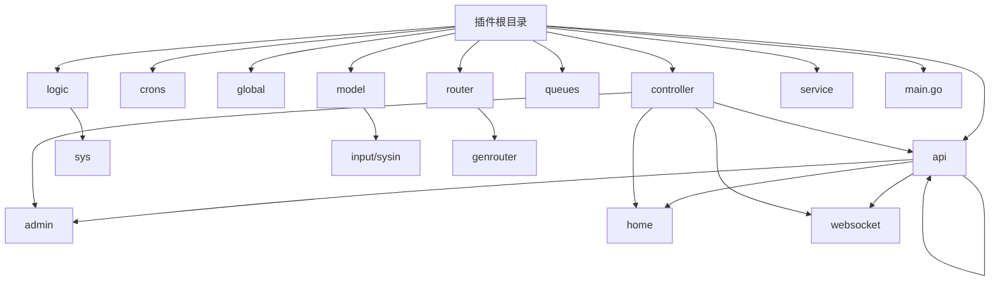

# 插件开发规范

<cite>
**本文档引用文件**  
- [main.go](file://server/addons/hgexample/main.go)
- [admin.go](file://server/addons/hgexample/router/admin.go)
- [api.go](file://server/addons/hgexample/router/api.go)
- [home.go](file://server/addons/hgexample/router/home.go)
- [websocket.go](file://server/addons/hgexample/router/websocket.go)
- [index.go](file://server/addons/hgexample/model/input/sysin/index.go)
- [index.go](file://server/addons/hgexample/controller/admin/sys/index.go)
- [index.go](file://server/addons/hgexample/logic/sys/index.go)
- [index.go](file://server/addons/hgexample/api/admin/index/index.go)
- [sys.go](file://server/addons/hgexample/service/sys.go)
- [init.go](file://server/addons/hgexample/global/init.go)
</cite>

## 目录
1. [简介](#简介)
2. [插件目录结构约定](#插件目录结构约定)
3. [核心组件职责说明](#核心组件职责说明)
4. [main.go 入口文件规范](#maingo-入口文件规范)
5. [路由注册与分组策略](#路由注册与分组策略)
6. [输入模型与数据验证](#输入模型与数据验证)
7. [服务层接口与逻辑实现](#服务层接口与逻辑实现)
8. [错误处理与日志记录](#错误处理与日志记录)
9. [数据库表前缀隔离机制](#数据库表前缀隔离机制)
10. [完整CURD模块开发示例](#完整curd模块开发示例)
11. [最佳实践总结](#最佳实践总结)

## 简介
本文档旨在为`hotgo`框架提供一套完整的插件开发规范，以`hgexample`插件作为参考实现。文档详细说明了插件的目录结构、各组件职责、入口文件实现要求、路由注册方式、API分组策略、输入模型定义、服务层设计、错误处理机制以及数据库隔离方案。通过遵循本规范，开发者可以快速构建符合标准的插件模块。

## 插件目录结构约定
`hgexample`插件遵循统一的目录组织结构，确保代码可维护性和一致性：



**目录说明：**
- `api`：定义HTTP请求和响应的数据结构
- `controller`：处理HTTP请求，调用逻辑层
- `crons`：定时任务逻辑
- `global`：插件全局变量和初始化逻辑
- `logic`：业务逻辑实现
- `model`：数据模型定义
- `queues`：消息队列处理
- `router`：路由配置
- `service`：服务接口定义
- `main.go`：插件入口文件

**目录来源**
- [main.go](file://server/addons/hgexample/main.go)
- [admin.go](file://server/addons/hgexample/router/admin.go)

## 核心组件职责说明
各组件在MVC架构中承担明确职责，实现关注点分离：

### Controller 层
负责接收HTTP请求，进行初步参数校验，并调用Logic层处理业务逻辑。返回标准化的API响应。

### Logic 层
实现核心业务逻辑，包含数据处理、事务管理、第三方服务调用等。不直接依赖HTTP上下文。

### Model 层
定义数据传输对象（DTO），包括请求输入、响应输出和数据库实体。

### Router 层
配置不同应用场景下的路由规则，支持管理后台、API接口、前台页面和WebSocket。

### Service 层
定义接口契约，实现依赖注入机制，便于单元测试和多实现切换。

**组件职责来源**
- [controller/admin/sys/index.go](file://server/addons/hgexample/controller/admin/sys/index.go#L1-L31)
- [logic/sys/index.go](file://server/addons/hgexample/logic/sys/index.go#L1-L36)
- [api/admin/index/index.go](file://server/addons/hgexample/api/admin/index/index.go#L1-L22)

## main.go 入口文件规范
`main.go`是插件的入口文件，必须实现`module`结构体并注册到系统。

### Register 方法实现
通过`init()`函数自动调用`newModule()`创建模块实例，并使用`addons.RegisterModule()`注册到框架。

```go
func init() {
	newModule()
}

func newModule() {
	m := &module{
		skeleton: &addons.Skeleton{
			Label:       "功能案例",
			Name:        "hgexample",
			Group:       1,
			Brief:       "系统的一些功能案例",
			Description: "系统自带的功能使用示例及其说明，包含一些简单的交互",
			Author:      "孟帅",
			Version:     "v1.0.0",
		},
		ctx: gctx.New(),
	}

	addons.RegisterModule(m)
}
```

### Initialize 方法实现
`Start()`方法在插件启动时调用，负责初始化资源和注册路由。

```go
func (m *module) Start(option *addons.Option) (err error) {
	// 初始化模块
	global.Init(m.ctx, m.skeleton)

	// 注册插件路由
	option.Server.Group("/", func(group *ghttp.RouterGroup) {
		group.Middleware(service.Middleware().Addon)
		router.Admin(m.ctx, group)
		router.Api(m.ctx, group)
		router.Home(m.ctx, group)
		router.WebSocket(m.ctx, group)
	})
	return
}
```

**入口文件规范来源**
- [main.go](file://server/addons/hgexample/main.go#L1-L98)
- [init.go](file://server/addons/hgexample/global/init.go#L12-L14)

## 路由注册与分组策略
插件支持多种应用场景的路由分组，通过统一前缀进行隔离。

### 路由分组类型
| 分组类型 | 前缀生成 | 中间件 | 用途 |
|---------|----------|--------|------|
| 管理后台 | `/admin/addons/{插件名}` | AdminAuth | 后台管理功能 |
| API接口 | `/api/addons/{插件名}` | ApiAuth | 前台API接口 |
| 前台页面 | `/addons/{插件名}` | 无 | 前台HTML页面 |
| WebSocket | `/ws/addons/{插件名}` | WebSocketAuth | 实时通信 |

### 路由注册示例
```go
func Admin(ctx context.Context, group *ghttp.RouterGroup) {
	prefix := addons.RouterPrefix(ctx, consts.AppAdmin, global.GetSkeleton().Name)
	group.Group(prefix, func(group *ghttp.RouterGroup) {
		group.Bind(
			sys.Index,
		)
		group.Middleware(service.Middleware().AdminAuth)
		group.Bind(
			sys.Comp,
			sys.Config,
			sys.Table,
			sys.TreeTable,
		)
	})
}
```

**路由策略来源**
- [admin.go](file://server/addons/hgexample/router/admin.go#L1-L37)
- [api.go](file://server/addons/hgexample/router/api.go#L1-L33)
- [home.go](file://server/addons/hgexample/router/home.go#L1-L26)
- [websocket.go](file://server/addons/hgexample/router/websocket.go#L1-L41)

## 输入模型与数据验证
输入模型定义在`model/input`目录下，采用结构体标签进行元数据描述。

### 输入模型定义
```go
type IndexTestInp struct {
	Name string `json:"name" d:"HotGo" dc:"名称"`
}
```

字段标签说明：
- `json`：JSON序列化字段名
- `d`：默认值
- `dc`：字段描述

### 数据验证方法
通过实现`Filter`接口进行数据过滤和验证：

```go
func (in *IndexTestInp) Filter(ctx context.Context) (err error) {
	return
}
```

可在该方法中添加自定义验证逻辑，如参数范围检查、格式验证等。

**输入模型来源**
- [index.go](file://server/addons/hgexample/model/input/sysin/index.go#L1-L28)

## 服务层接口与逻辑实现
采用接口+实现的模式，实现业务逻辑与接口定义的解耦。

### 服务接口定义
在`service`包中定义接口契约：

```go
type ISysIndex interface {
	Test(ctx context.Context, in *sysin.IndexTestInp) (res *sysin.IndexTestModel, err error)
}
```

### 逻辑实现注册
通过`init()`函数自动注册实现：

```go
func init() {
	service.RegisterSysIndex(NewSysIndex())
}
```

### 依赖注入机制
通过全局函数获取服务实例，实现松耦合：

```go
data, err := service.SysIndex().Test(ctx, &req.IndexTestInp)
```

**服务层实现来源**
- [sys.go](file://server/addons/hgexample/service/sys.go#L1-L140)
- [index.go](file://server/addons/hgexample/logic/sys/index.go#L1-L36)

## 错误处理与日志记录
遵循统一的错误处理规范，确保系统稳定性和可维护性。

### 错误传递规范
- 错误由底层向上逐层传递，不重复处理
- 使用`if err != nil { return }`模式快速返回
- 在适当层级添加错误上下文信息

### 日志记录建议
- 在关键业务节点添加日志输出
- 记录输入参数和返回结果（敏感信息需脱敏）
- 异常情况记录完整错误堆栈

示例：
```go
func (c *cIndex) Test(ctx context.Context, req *index.TestReq) (res *index.TestRes, err error) {
	data, err := service.SysIndex().Test(ctx, &req.IndexTestInp)
	if err != nil {
		return
	}

	res = new(index.TestRes)
	res.IndexTestModel = data
	return
}
```

**错误处理来源**
- [index.go](file://server/addons/hgexample/controller/admin/sys/index.go#L1-L31)

## 数据库表前缀隔离机制
插件数据表采用统一前缀进行隔离，避免命名冲突。

### 表名约定
所有插件表名以`addon_{插件名}_`为前缀，例如：
- `addon_hgexample_table`
- `addon_hgexample_tenant_order`

### ORM模型配置
在Logic层配置ORM模型时指定表名：

```go
func (s *sSysTable) Model(ctx context.Context, option ...*handler.Option) *gdb.Model {
	return dao.AddonHgexampleTable.Ctx(ctx).Model(option...)
}
```

通过这种方式实现数据层面的完全隔离，确保多插件共存时的数据安全。

**数据库隔离来源**
- [server/dao/internal/addon_hgexample_table.go](file://server/dao/internal/addon_hgexample_table.go)
- [logic/sys/table.go](file://server/addons/hgexample/logic/sys/table.go)

## 完整CURD模块开发示例
以`table`模块为例，展示完整CURD功能开发流程。

### 1. 定义API接口
在`api/admin/table/table.go`中定义请求响应结构：

```go
type TableListReq struct {
	g.Meta `path:"/table/list" method:"get" tags:"功能案例" summary:"列表"`
	sysin.TableListInp
}

type TableListRes struct {
	List []*sysin.TableListModel `json:"list" dc:"列表"`
}
```

### 2. 实现Controller
在`controller/admin/sys/table.go`中处理HTTP请求：

```go
func (c *cTable) List(ctx context.Context, req *table.TableListReq) (res *table.TableListRes, err error) {
	list, totalCount, err := service.SysTable().List(ctx, &req.TableListInp)
	if err != nil {
		return
	}

	res = &table.TableListRes{
		List: list,
	}
	res.Pagination(totalCount, req.Page, req.PerPage)
	return
}
```

### 3. 实现Logic业务逻辑
在`logic/sys/table.go`中实现核心逻辑：

```go
func (s *sSysTable) List(ctx context.Context, in *sysin.TableListInp) (list []*sysin.TableListModel, totalCount int, err error) {
	mod := s.Model(ctx)
	// 查询逻辑...
	err = mod.Page(in.Page, in.PerPage).ScanAndCount(&list, &totalCount, false)
	return
}
```

### 4. 注册路由
在`router/admin.go`中绑定控制器：

```go
group.Bind(
	sys.Table,
)
```

**CURD示例来源**
- [table.go](file://server/addons/hgexample/api/admin/table/table.go)
- [table.go](file://server/addons/hgexample/controller/admin/sys/table.go)
- [table.go](file://server/addons/hgexample/logic/sys/table.go)
- [admin.go](file://server/addons/hgexample/router/admin.go)

## 最佳实践总结
遵循以下最佳实践可提高插件质量和开发效率：

### 目录结构规范
- 严格遵守约定的目录结构
- 按功能模块组织子目录
- 保持代码组织的一致性

### 代码质量要求
- 添加完整的注释文档
- 实现单元测试覆盖核心逻辑
- 遵循Go语言编码规范

### 性能优化建议
- 合理使用缓存减少数据库压力
- 批量操作替代循环单条处理
- 异步处理耗时任务

### 安全性考虑
- 验证所有用户输入
- 防止SQL注入和XSS攻击
- 敏感操作添加权限校验

通过遵循本规范，开发者可以快速构建高质量、可维护的插件模块，确保与主系统的良好集成和长期可维护性。

**最佳实践来源**
- [main.go](file://server/addons/hgexample/main.go)
- [所有相关文件](file://server/addons/hgexample/)