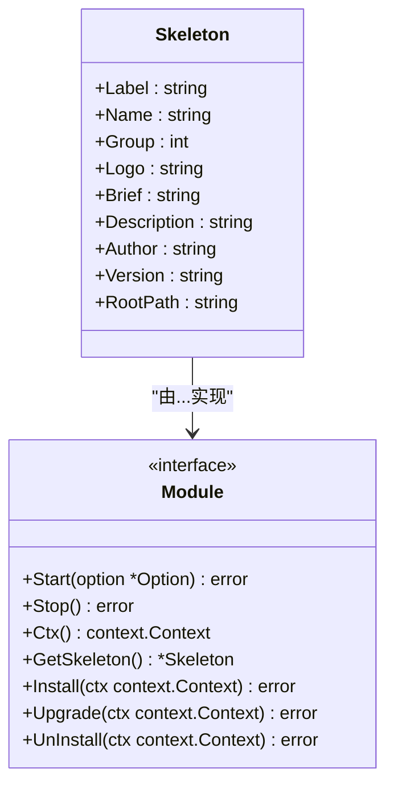
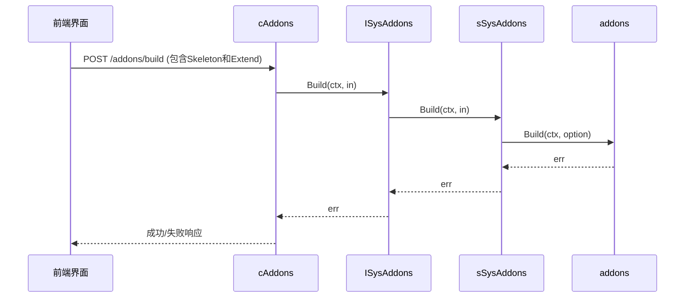

# 插件构建与打包

<cite>
**本文档引用的文件**
- [build.go](file://server/internal/library/addons/build.go)
- [build_layout.go](file://server/internal/library/addons/build_layout.go)
- [module.go](file://server/internal/library/addons/module.go)
- [addons.go](file://server/internal/library/addons/addons.go)
- [addons.go](file://server/addons/hgexample/README.MD)
</cite>

## 目录
1. [简介](#简介)
2. [构建流程详解](#构建流程详解)
3. [打包目录结构](#打包目录结构)
4. [模块元信息生成](#模块元信息生成)
5. [命令行构建示例](#命令行构建示例)
6. [README.MD的作用](#readmemd的作用)
7. [环境一致性与可重复性](#环境一致性与可重复性)

## 简介
本指南深入解析HotGo框架中插件的构建与打包机制。通过分析核心构建文件，详细说明如何将插件源码编译并打包为`.zip`或`.tar.gz`格式的发布包，确保资源文件、二进制和配置被正确包含。

## 构建流程详解

插件构建的核心逻辑位于`internal/library/addons/build.go`文件中。`Build`函数是整个构建过程的入口，它接收一个`BuildOption`结构体作为参数，该结构体包含了构建所需的所有配置和元数据。

构建流程主要分为以下几个步骤：
1.  **路径验证与初始化**：首先获取插件资源路径，并构建目标路径、模块路径、Web API路径和Web视图路径。
2.  **目录冲突检查**：调用`checkBuildDir`函数检查目标构建目录、模块文件等是否已存在，防止覆盖已有插件。
3.  **源码扫描与复制**：递归扫描配置中指定的源码路径（`SrcPath`），并将所有可读的文件复制到目标构建目录。
4.  **内容替换与模板填充**：在复制文件的过程中，使用`replaces`映射表对文件内容进行字符串替换。这些占位符（如`@{.name}`、`@{.version}`）会被`Skeleton`结构体中的实际值填充，实现代码的动态生成。
5.  **模块注入**：创建`modules`目录下的Go文件，通过`importModules`模板隐式导入新插件，使其能被主程序识别。
6.  **Web前端文件生成**：为插件生成对应的Web API配置文件和Vue组件页面，实现前后端配置的联动。
7.  **扩展资源创建**：根据`Extend`选项，决定是否创建静态资源目录（`public`）和模板目录（`template`），并填充默认文件。

**Section sources**
- [build.go](file://server/internal/library/addons/build.go#L27-L124)

## 打包目录结构

插件的打包目录结构由`internal/library/addons/build_layout.go`文件中的常量定义。该文件定义了构建过程中生成的各种文件和目录的模板内容。

```mermaid
flowchart TD
A[构建根目录] --> B[Go后端代码]
A --> C[Web前端代码]
A --> D[静态资源]
A --> E[模板文件]
B --> B1[controller]
B --> B2[logic]
B --> B3[model]
B --> B4[router]
B --> B5[service]
B --> B6[main.go]
C --> C1[src/api/addons/{name}]
C --> C2[src/views/addons/{name}]
D --> D1[resource/addons/{name}/public]
E --> E1[resource/addons/{name}/template]
```

**Diagram sources**
- [build_layout.go](file://server/internal/library/addons/build_layout.go#L1-L233)

**Section sources**
- [build_layout.go](file://server/internal/library/addons/build_layout.go#L1-L233)

## 模块元信息生成

`module.go`文件在构建过程中扮演着定义插件元信息的关键角色。`Skeleton`结构体是插件元信息的核心，它定义了插件的名称、标识、分组、作者、版本号等关键属性。



**Diagram sources**
- [module.go](file://server/internal/library/addons/module.go#L27-L52)

当`Build`函数执行时，传入的`BuildOption.Skeleton`字段的值会直接用于填充生成的代码模板，从而将这些元信息固化到插件的各个部分（如文件名、API路由、配置项等）。`Module`接口则定义了插件的生命周期方法，确保插件具备安装、启动、停止和卸载的能力。

**Section sources**
- [module.go](file://server/internal/library/addons/module.go#L27-L52)

## 命令行构建示例

虽然文档中未直接提供命令行脚本，但可以通过分析代码调用链来推断构建命令。构建请求通常由前端发起，最终调用`cAddons.Build`控制器方法。



**Diagram sources**
- [addons.go](file://server/internal/controller/admin/sys/addons.go#L33-L36)
- [addons.go](file://server/internal/logic/sys/addons.go#L95-L111)
- [build.go](file://server/internal/library/addons/build.go#L27-L124)

一个典型的构建请求体（JSON）可能如下所示：
```json
{
  "skeleton": {
    "label": "我的插件",
    "name": "myplugin",
    "group": 1,
    "brief": "这是一个示例插件",
    "description": "用于演示构建流程",
    "author": "开发者",
    "version": "1.0.0"
  },
  "extend": ["resource_public", "resource_template"]
}
```

## README.MD的作用

`README.MD`文件在插件包中起着至关重要的作用，它是插件的使用说明书。以`server/addons/hgexample/README.MD`为例，它包含了以下关键信息：

-   **简介**：简要描述插件的功能和目的。
-   **使用说明**：指导用户如何使用插件提供的功能。
-   **安装步骤**：提供详细的安装指南，包括依赖项、文件拷贝、模块注册和后台安装等步骤。
-   **常用命令行**：列出与插件开发和维护相关的常用命令，如代码生成命令。

该文件是用户了解和使用插件的第一手资料，确保了插件的可维护性和易用性。

**Section sources**
- [addons.go](file://server/addons/hgexample/README.MD#L1-L40)

## 环境一致性与可重复性

构建过程通过以下机制确保了可重复性和环境一致性：

1.  **配置驱动**：构建过程依赖于`BuildAddonConfig`配置，该配置定义了源码路径、Web API路径等关键参数，确保在不同环境中使用相同的配置进行构建。
2.  **模板化生成**：使用Go模板和字符串替换机制，将元信息动态注入到代码中，避免了手动修改代码的错误。
3.  **路径抽象**：`addons.go`文件中的`GetResourcePath`、`ViewPath`、`StaticPath`等函数提供了路径的抽象，使得资源路径的配置可以集中管理，便于在不同部署环境中调整。
4.  **原子性操作**：构建过程在执行前会检查目标目录是否已存在，防止意外覆盖，保证了构建操作的原子性和安全性。

这些设计确保了无论在开发、测试还是生产环境，只要使用相同的输入（`Skeleton`和`Extend`），就能生成完全一致的插件包。

**Section sources**
- [addons.go](file://server/internal/library/addons/addons.go#L1-L61)
- [build.go](file://server/internal/library/addons/build.go#L27-L124)