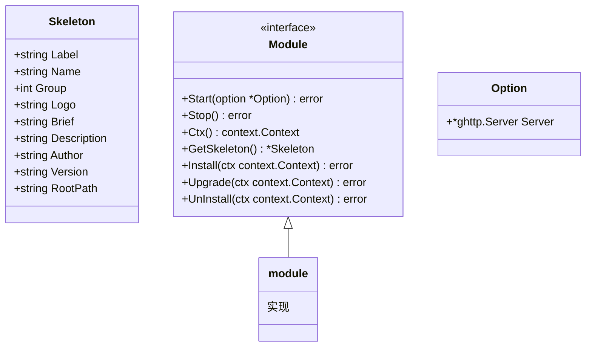
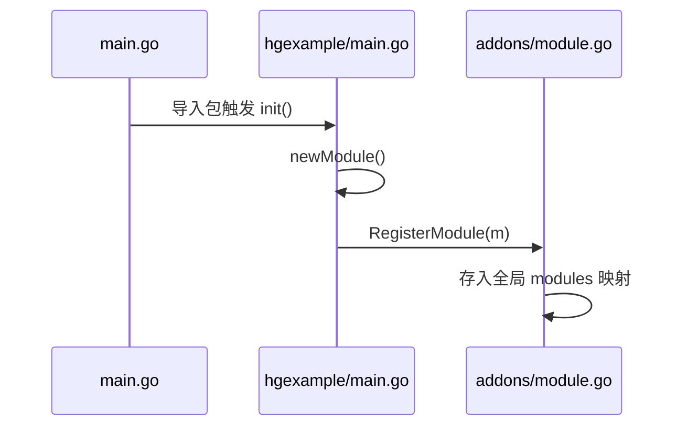
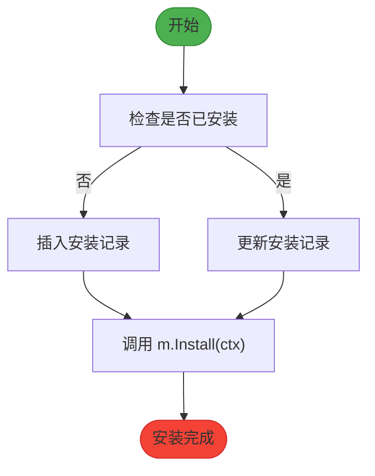
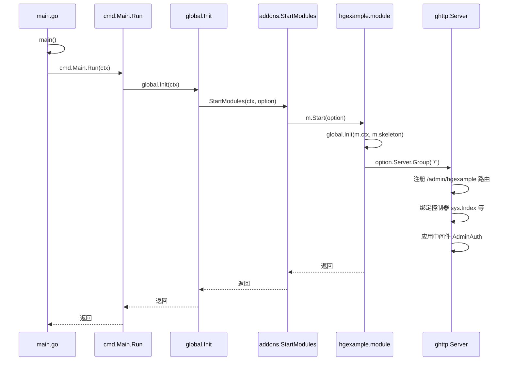

# 插件注册与加载机制

<cite>
**本文档引用文件**  
- [main.go](file://server/main.go)
- [addons.go](file://server/addons/addons.go)
- [hgexample.go](file://server/addons/modules/hgexample.go)
- [addons.go](file://server/internal/library/addons/addons.go)
- [module.go](file://server/internal/library/addons/module.go)
- [install.go](file://server/internal/library/addons/install.go)
- [httproutes.go](file://server/internal/global/httproutes.go)
- [main.go](file://server/addons/hgexample/main.go)
- [global.go](file://server/addons/hgexample/global/global.go)
- [admin.go](file://server/addons/hgexample/router/admin.go)
- [consts.go](file://server/internal/consts/addons.go)
- [sys_addons_install.go](file://server/internal/dao/sys_addons_install.go)
- [addons.go](file://server/internal/logic/sys/addons.go)
</cite>

## 目录
1. [引言](#引言)
2. [插件注册与加载流程概览](#插件注册与加载流程概览)
3. [核心组件分析](#核心组件分析)
4. [插件生命周期管理](#插件生命周期管理)
5. [路由注入机制](#路由注入机制)
6. [时序图：插件加载全过程](#时序图插件加载全过程)
7. [内存管理与模块注册](#内存管理与模块注册)
8. [总结](#总结)

## 引言
本项目采用插件化架构设计，通过动态加载机制实现功能扩展。插件系统在应用启动时自动扫描、注册并加载已安装的插件模块，支持安装、启用、禁用、卸载等完整生命周期管理。本文将深入剖析从 `server/main.go` 启动调用 `addons.Init` 开始，到插件路由注入主应用 Gin 路由器的全过程。

## 插件注册与加载流程概览
插件系统的启动流程始于 `server/main.go` 文件中的 `main()` 函数。该函数通过导入 `_ "hotgo/addons/modules"` 触发插件模块的初始化，并调用 `cmd.Main.Run(ctx)` 启动主命令，进而触发插件初始化流程。

插件加载的核心路径如下：
1. 主程序启动时导入插件模块包
2. 插件模块通过 `init()` 函数注册自身
3. 系统扫描 `addons` 目录并读取元数据
4. 判断插件是否已安装（查询数据库）
5. 若已安装，则调用插件的 `Start` 方法
6. 插件注册其路由至主应用路由器

此机制实现了插件的动态发现与热加载，无需重启主服务即可启用新功能。

**Section sources**
- [main.go](file://server/main.go#L1-L25)
- [hgexample.go](file://server/addons/modules/hgexample.go#L1-L9)

## 核心组件分析

### 插件骨架与模块接口
`internal/library/addons` 包定义了插件系统的核心结构。`Skeleton` 结构体表示插件的元数据信息，包括名称、标签、版本、作者、简介等。`Module` 接口定义了所有插件必须实现的方法集合，包括 `Start`、`Stop`、`Install`、`Upgrade`、`UnInstall` 等。

每个插件需实现 `Module` 接口，并通过 `RegisterModule` 函数注册到全局模块列表中。注册过程由插件自身的 `init()` 函数触发，确保在应用启动早期完成注册。



**Diagram sources**
- [module.go](file://server/internal/library/addons/module.go#L20-L50)

**Section sources**
- [module.go](file://server/internal/library/addons/module.go#L1-L187)

### 插件注册实现（以 hgexample 为例）
以 `hgexample` 插件为例，其 `main.go` 文件中定义了一个 `module` 结构体并实现了 `Module` 接口。`init()` 函数调用 `newModule()` 创建实例并注册到系统中。

`Start` 方法负责启动插件，包括初始化上下文、注册中间件和路由。`GetSkeleton` 返回插件的元信息，供系统识别和展示。



**Diagram sources**
- [main.go](file://server/addons/hgexample/main.go#L27-L97)
- [module.go](file://server/internal/library/addons/module.go#L100-L120)

**Section sources**
- [main.go](file://server/addons/hgexample/main.go#L1-L98)
- [global.go](file://server/addons/hgexample/global/global.go#L1-L13)

## 插件生命周期管理
插件系统提供了完整的生命周期管理功能，包括安装、升级、卸载等操作，均由 `internal/library/addons/install.go` 中的函数实现。

### 安装状态判断
`IsInstall(m Module)` 函数通过查询 `sys_addons_install` 表判断插件是否已安装。若记录存在且状态为 `AddonsInstallStatusOk`，则视为已安装。

### 安装流程
`Install(m Module)` 函数执行安装逻辑：
1. 查询数据库中是否已有安装记录
2. 若无记录或状态非“已安装”，则插入/更新安装记录
3. 调用插件自身的 `Install(ctx)` 方法执行自定义安装逻辑（如建表、初始化数据）

### 升级与卸载
- `Upgrade`：检查插件是否已安装，若版本号更高则执行升级逻辑
- `UnInstall`：标记插件为“已卸载”状态，并调用插件的 `UnInstall` 方法执行清理逻辑

这些操作均在数据库事务中执行，保证数据一致性。



**Diagram sources**
- [install.go](file://server/internal/library/addons/install.go#L50-L120)
- [sys_addons_install.go](file://server/internal/dao/sys_addons_install.go#L1-L23)

**Section sources**
- [install.go](file://server/internal/library/addons/install.go#L1-L121)
- [consts.go](file://server/internal/consts/addons.go#L1-L81)

## 路由注入机制
插件的路由通过 `httproutes.go` 文件中的机制注入到主应用的 Gin 路由器中。

### 路由前缀生成
`RouterPrefix(ctx, app, name string)` 函数根据配置生成路由前缀，格式为 `/应用名称/插件模块名称`。例如，后台管理应用中 `hgexample` 插件的路由前缀为 `/admin/hgexample`。

### 路由注册流程
在插件的 `Start` 方法中，通过 `option.Server.Group()` 注册路由组，并绑定控制器。以 `hgexample` 的后台路由为例：

```go
func Admin(ctx context.Context, group *ghttp.RouterGroup) {
    prefix := addons.RouterPrefix(ctx, consts.AppAdmin, global.GetSkeleton().Name)
    group.Group(prefix, func(group *ghttp.RouterGroup) {
        group.Bind(sys.Index)
        group.Middleware(service.Middleware().AdminAuth)
        group.Bind(sys.Comp, sys.Config, sys.Table, sys.TreeTable)
    })
    genrouter.Register(ctx, group)
}
```

此代码将 `sys.Index` 等控制器绑定到 `/admin/hgexample` 前缀下，并应用管理员认证中间件。

**Section sources**
- [admin.go](file://server/addons/hgexample/router/admin.go#L1-L37)
- [httproutes.go](file://server/internal/global/httproutes.go#L1-L126)

## 时序图：插件加载全过程
以下时序图展示了从主程序启动到插件路由注册的完整流程：



**Diagram sources**
- [main.go](file://server/main.go#L1-L25)
- [module.go](file://server/internal/library/addons/module.go#L60-L70)
- [main.go](file://server/addons/hgexample/main.go#L50-L63)
- [admin.go](file://server/addons/hgexample/router/admin.go#L1-L37)

## 内存管理与模块注册
系统使用 `sync.Mutex` 保护的全局映射 `modules map[string]Module` 来管理所有注册的插件模块。`RegisterModule` 函数确保模块名称唯一，防止重复注册。

已安装模块通过 `filterInstalled()` 函数筛选，该函数遍历所有注册模块并调用 `IsInstall()` 判断其安装状态。`StartModules` 函数仅启动已安装的模块。

插件的静态资源路径也在此阶段配置，通过 `AddStaticPath` 函数将插件的 `public` 目录映射到 HTTP 服务器的静态路由，实现静态文件访问。

**Section sources**
- [module.go](file://server/internal/library/addons/module.go#L75-L187)

## 总结
本系统通过一套完整的插件注册与动态加载机制，实现了高度可扩展的架构设计。关键特性包括：
- 基于接口的插件规范，确保一致性
- 数据库驱动的安装状态管理
- 自动化的路由注入与中间件应用
- 安全的并发控制与内存管理
- 灵活的静态资源映射机制

该机制使得第三方开发者可以轻松开发和集成新功能，而无需修改主程序代码，极大提升了系统的可维护性和可扩展性。