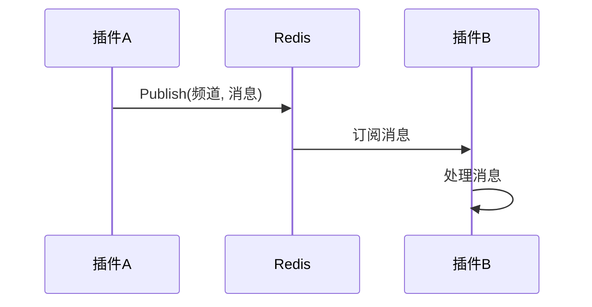

# 插件间通信

<cite>
**本文档引用的文件**  
- [addons.go](file://server/internal/library/addons/addons.go)
- [global.go](file://server/addons/hgexample/global/global.go)
- [init.go](file://server/addons/hgexample/global/init.go)
- [publish.go](file://server/internal/library/hgrds/pubsub/publish.go)
- [subscribe.go](file://server/internal/library/hgrds/pubsub/subscribe.go)
</cite>

## 目录
1. [简介](#简介)
2. [共享全局实例通信](#共享全局实例通信)
3. [主应用调用机制](#主应用调用机制)
4. [基于Redis的异步消息通信](#基于redis的异步消息通信)
5. [通信模式最佳实践](#通信模式最佳实践)
6. [总结](#总结)

## 简介
在沙箱化插件架构中，插件间通信是实现功能协同的关键。本指南详细说明了多种安全、高效的插件间通信模式，包括通过共享全局实例进行数据交换、利用主应用提供的调用机制进行服务调用或事件发布/订阅，以及基于Redis消息队列的异步通信。同时强调了避免直接导入其他插件包以防止耦合的重要性，并推荐使用接口或事件驱动模式。

## 共享全局实例通信
插件可以通过共享的全局实例进行数据交换。例如，`global.DB`和`global.Cache`等全局实例为插件提供了统一的数据访问接口。这种方式简单直接，适用于需要频繁访问共享数据的场景。

**Section sources**
- [global.go](file://server/addons/hgexample/global/global.go#L1-L12)
- [init.go](file://server/addons/hgexample/global/init.go#L1-L22)

## 主应用调用机制
主应用提供了`addons.Call`或`addons.Emit`机制，允许插件进行服务调用或事件发布/订阅。这种机制通过主应用作为中介，确保了插件间的松耦合和安全性。

**Section sources**
- [addons.go](file://server/internal/library/addons/addons.go#L1-L61)

## 基于Redis的异步消息通信
基于`hgrds/pubsub`的Redis消息队列实现了插件间的异步通信。通过`Publish`函数推送消息，以及`Subscribe`函数订阅消息，插件可以在不阻塞主线程的情况下进行通信。这种方式适用于需要处理大量消息或对实时性要求不高的场景。

**Diagram sources**
- [publish.go](file://server/internal/library/hgrds/pubsub/publish.go#L1-L16)
- [subscribe.go](file://server/internal/library/hgrds/pubsub/subscribe.go#L1-L82)

## 通信模式最佳实践
为了避免插件间的紧耦合，应避免直接导入其他插件包。推荐使用接口或事件驱动模式来实现插件间的通信。这样不仅可以提高系统的可维护性和可扩展性，还能确保各插件的独立性和安全性。

**Section sources**
- [addons.go](file://server/internal/library/addons/addons.go#L1-L61)
- [publish.go](file://server/internal/library/hgrds/pubsub/publish.go#L1-L16)
- [subscribe.go](file://server/internal/library/hgrds/pubsub/subscribe.go#L1-L82)

## 总结
插件间通信是构建灵活、可扩展系统的关键。通过合理选择和使用共享全局实例、主应用调用机制和基于Redis的异步消息通信，可以有效实现插件间的协同工作。同时，遵循最佳实践，避免直接导入其他插件包，使用接口或事件驱动模式，将有助于构建更加健壮和安全的系统。