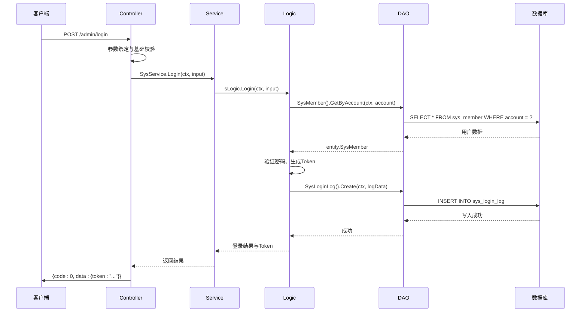

# 核心架构

<cite>
**本文档中引用的文件**  
- [admin_auth.go](file://server/internal/logic/middleware/admin_auth.go)
- [api_auth.go](file://server/internal/logic/middleware/api_auth.go)
- [pre_filter.go](file://server/internal/logic/middleware/pre_filter.go)
- [sys.go](file://server/internal/service/sys.go)
- [addons.go](file://server/internal/dao/internal/sys_addons_install.go)
- [sys_member.go](file://server/internal/dao/internal/sys_member.go)
- [sys_login_log.go](file://server/internal/dao/internal/sys_login_log.go)
- [sys_config.go](file://server/internal/dao/internal/sys_config.go)
- [login.go](file://server/internal/controller/admin/sys/login.go)
- [logic.go](file://server/internal/logic/sys/logic.go)
</cite>

## 目录
1. [引言](#引言)
2. [MVC分层架构详解](#mvc分层架构详解)
3. [典型API请求的数据流序列图](#典型api请求的数据流序列图)
4. [插件化架构与热插拔机制](#插件化架构与热插拔机制)
5. [中间件在请求生命周期中的作用](#中间件在请求生命周期中的作用)
6. [结论](#结论)

## 引言
本项目采用清晰的MVC分层架构，结合GoFrame框架实现高内聚、低耦合的系统设计。整体架构分为`Controller`、`Service`、`Logic`、`DAO`四层，配合插件化扩展机制和丰富的中间件体系，构建了一个可维护、可扩展的企业级应用。本文将深入剖析各层职责、调用流程及协作机制，帮助开发者理解系统设计精髓。

## MVC分层架构详解

### Controller层：请求入口与参数校验
`Controller`层位于系统最外层，负责接收HTTP请求、解析路由参数，并进行初步的输入校验。根据项目结构，`Controller`分为`admin`（后台管理）、`api`（前端接口）、`home`（门户）和`websocket`（实时通信）四大模块，分别处理不同场景的请求。

每个`Controller`方法通常遵循以下流程：
1. 接收请求对象`*ghttp.Request`
2. 调用`r.Parse()`进行参数绑定与基础校验
3. 调用`Service`层接口执行业务逻辑
4. 返回标准化响应

例如，后台登录请求由`server/internal/controller/admin/sys/login.go`处理，它接收用户名密码，调用`SysService.Login`完成认证流程。

**Section sources**
- [login.go](file://server/internal/controller/admin/sys/login.go)

### Service层：服务协调与接口定义
`Service`层是系统的协调中心，定义了所有业务服务的接口契约。在`server/internal/service/sys.go`中，通过接口`ISysXXX`的形式声明了如`ISysLogin`、`ISysConfig`等服务，实现了清晰的依赖倒置。

`Service`层不包含具体实现，而是通过注册机制（`RegisterXXX`函数）动态绑定`Logic`层的具体实现。这种设计使得接口与实现分离，便于单元测试和功能替换。

**Section sources**
- [sys.go](file://server/internal/service/sys.go)

### Logic层：核心业务逻辑封装
`Logic`层是业务规则的核心执行者，实现了`Service`层定义的接口。以登录逻辑为例，`server/internal/logic/sys/logic.go`中的`sLogic`结构体实现了`ISysLogin`接口的`Login`方法。

该层主要职责包括：
- 执行复杂的业务规则判断
- 调用`DAO`层进行数据持久化操作
- 处理事务管理
- 调用外部服务（如短信、邮件）
- 生成和验证Token

**Section sources**
- [logic.go](file://server/internal/logic/sys/logic.go)

### DAO层：数据库操作与GORM封装
`DAO`（Data Access Object）层直接与数据库交互，使用GORM作为ORM框架。每个数据表对应一个DAO文件，如`sys_member.go`、`sys_login_log.go`等，位于`server/internal/dao/internal/`目录下。

DAO层通过`gdb.Model`提供链式调用API，封装了增删改查等基本操作。上层通过`Service`->`Logic`->`DAO`的调用链访问数据，保证了数据访问的安全性和一致性。

**Section sources**
- [sys_member.go](file://server/internal/dao/internal/sys_member.go)
- [sys_login_log.go](file://server/internal/dao/internal/sys_login_log.go)
- [sys_config.go](file://server/internal/dao/internal/sys_config.go)

## 典型API请求的数据流序列图

**Diagram sources**
- [login.go](file://server/internal/controller/admin/sys/login.go)
- [sys.go](file://server/internal/service/sys.go)
- [logic.go](file://server/internal/logic/sys/logic.go)
- [sys_member.go](file://server/internal/dao/internal/sys_member.go)
- [sys_login_log.go](file://server/internal/dao/internal/sys_login_log.go)

## 插件化架构与热插拔机制

系统通过`server/addons`目录实现插件化架构。每个插件（如`hgexample`）都是一个独立的模块，包含自己的`controller`、`logic`、`dao`、`model`等完整MVC结构。

核心机制如下：
1. **插件注册**：在`server/internal/library/addons/module.go`中注册插件信息
2. **路由注入**：启动时动态加载插件的路由配置到主应用
3. **服务发现**：通过接口注册机制，插件可调用核心服务或被核心调用
4. **热重载**：修改插件代码后可动态加载，无需重启主服务

这种设计实现了功能的热插拔，新功能以插件形式开发，不影响主系统稳定性，极大提升了系统的可扩展性。

**Section sources**
- [addons.go](file://server/internal/dao/internal/sys_addons_install.go)

## 中间件在请求生命周期中的作用

中间件是贯穿整个请求生命周期的关键组件，位于`server/internal/logic/middleware/`目录下，通过`r.Middleware.Next()`实现责任链模式。

### 核心中间件分析

#### 鉴权中间件
- `admin_auth.go`：后台管理员鉴权，验证JWT Token，检查角色权限
- `api_auth.go`：API接口鉴权，适用于前端用户访问
- 执行流程：Token解析 → 用户上下文注入 → 权限校验 → 放行或拒绝

#### 预处理中间件
- `pre_filter.go`：请求输入预处理，自动调用实现了`validate.Filter`接口的结构体的过滤方法
- 功能：参数清洗、默认值填充、敏感词过滤等

#### 限流与安全中间件
- `limit_blacklist.go`：基于IP的黑名单拦截
- `limit_develop.go`：开发环境限制

所有中间件通过`service.Middleware()`统一注册，在请求到达`Controller`前依次执行，形成完整的安全与处理链条。

**Section sources**
- [admin_auth.go](file://server/internal/logic/middleware/admin_auth.go)
- [api_auth.go](file://server/internal/logic/middleware/api_auth.go)
- [pre_filter.go](file://server/internal/logic/middleware/pre_filter.go)

## 结论
本系统通过严谨的MVC分层、清晰的接口定义、灵活的插件机制和强大的中间件体系，构建了一个高内聚、低耦合、易扩展的现代化后端架构。开发者在遵循此架构进行开发时，应严格遵守各层职责划分，利用好现有的服务注册、中间件和DAO封装机制，以确保代码的一致性和可维护性。