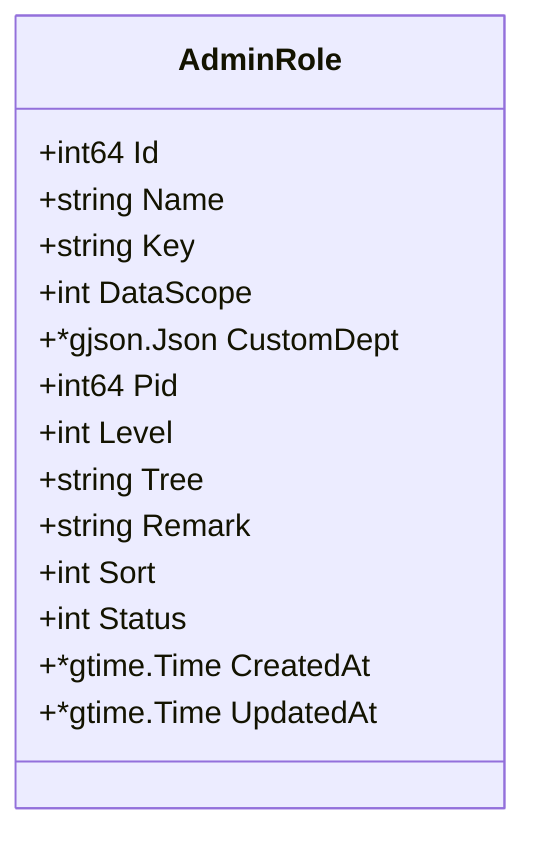
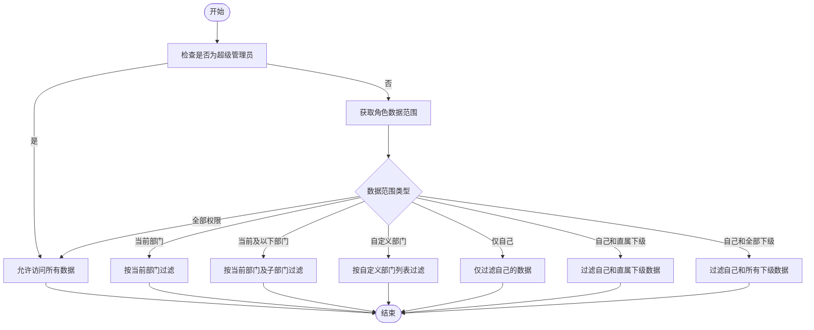
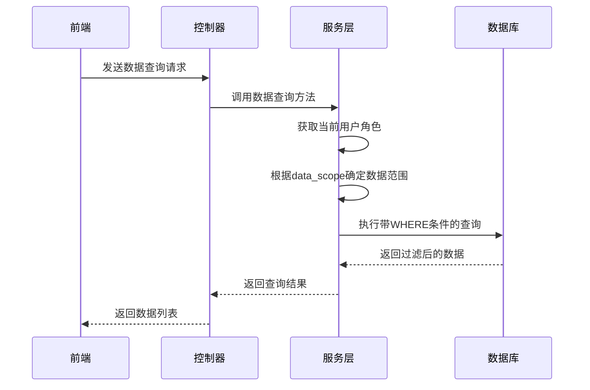

# 数据权限

<cite>
**本文档引用的文件**   
- [admin_role.go](file://server/internal/dao/admin_role.go)
- [role.go](file://server/internal/logic/admin/role.go)
- [dept.go](file://server/internal/logic/admin/dept.go)
- [role.go](file://server/internal/model/input/adminin/role.go)
- [dept.go](file://server/internal/model/input/adminin/dept.go)
- [role.go](file://server/internal/consts/role.go)
- [entity.go](file://server/internal/model/entity/admin_role.go)
</cite>

## 目录
1. [介绍](#介绍)
2. [数据权限与菜单权限的区别](#数据权限与菜单权限的区别)
3. [数据权限实现方案](#数据权限实现方案)
4. [核心数据结构](#核心数据结构)
5. [数据范围配置](#数据范围配置)
6. [后端查询逻辑](#后端查询逻辑)
7. [部门验证逻辑](#部门验证逻辑)
8. [Casbin集成](#casbin集成)
9. [总结](#总结)

## 介绍
数据权限是系统权限管理的重要组成部分，用于控制用户在特定页面上能够查看和操作的数据范围。与菜单权限不同，数据权限关注的是数据层面的访问控制，确保用户只能访问其权限范围内的数据。

## 数据权限与菜单权限的区别
- **菜单权限**：控制用户能否访问某个页面或功能模块，属于功能层面的权限控制。
- **数据权限**：控制用户在已访问的页面上能看到哪些具体数据，属于数据层面的访问控制。

例如，一个用户可能有权限访问“用户列表”页面（菜单权限），但只能看到自己所在部门的用户信息（数据权限）。

## 数据权限实现方案
本系统采用基于角色的数据权限控制方案，通过角色的`data_scope`字段来决定用户的数据访问范围。该方案支持多种数据范围类型，包括全部权限、本部门、本部门及子部门、自定义部门等。

## 核心数据结构



**图示来源**
- [entity.go](file://server/internal/model/entity/admin_role.go#L12-L26)

**本节来源**
- [entity.go](file://server/internal/model/entity/admin_role.go#L12-L26)

## 数据范围配置



**图示来源**
- [role.go](file://server/internal/consts/role.go#L10-L90)

**本节来源**
- [role.go](file://server/internal/consts/role.go#L10-L90)

## 后端查询逻辑
当查询数据时，后端会根据当前登录用户的角色和`data_scope`值动态构建查询条件：

1. 首先检查用户是否为超级管理员，如果是则允许访问所有数据
2. 如果不是超级管理员，则根据`data_scope`的值添加相应的WHERE条件
3. 对于部门相关的数据查询，会根据用户所属部门和数据范围类型生成部门ID列表
4. 将生成的部门ID列表作为IN条件添加到SQL查询中

例如，在查询用户列表时，系统会根据当前用户的数据权限范围，自动添加类似`AND dept_id IN (1,2,3)`的查询条件。



**图示来源**
- [role.go](file://server/internal/logic/admin/role.go#L64-L91)
- [dept.go](file://server/internal/logic/admin/dept.go#L152-L236)

**本节来源**
- [role.go](file://server/internal/logic/admin/role.go#L64-L91)
- [dept.go](file://server/internal/logic/admin/dept.go#L152-L236)

## 部门验证逻辑
系统通过部门关系树来管理组织架构，并在数据权限控制中发挥重要作用：

1. 每个部门都有一个`tree`字段，记录其在组织架构中的路径
2. 使用`tree.GetIdLabel(pid)`方法生成部门ID标签
3. 通过`WhereLike`查询条件匹配部门关系树，实现层级权限控制
4. `VerifyDeptId`方法用于验证部门ID的有效性，确保用户只能访问其权限范围内的部门数据

这种基于关系树的实现方式能够高效地处理复杂的组织架构和权限继承关系。

**本节来源**
- [dept.go](file://server/internal/logic/admin/dept.go#L254-L282)

## Casbin集成
系统通过Casbin进行细粒度的权限控制，数据权限与Casbin的集成方式如下：

1. 在`Verify`方法中，首先检查用户是否为超级管理员
2. 如果不是超级管理员，则调用Casbin的`Enforce`方法进行权限验证
3. Casbin策略中包含了角色、路径和HTTP方法的组合，用于控制API访问权限
4. 数据权限控制在业务逻辑层实现，与Casbin的功能互补

```go
func (s *sAdminRole) Verify(ctx context.Context, path, method string) bool {
    // ... 其他逻辑
    ok, err := casbin.Enforcer.Enforce(user.RoleKey, path, method)
    // ... 错误处理
    return ok
}
```

**本节来源**
- [role.go](file://server/internal/logic/admin/role.go#L30-L45)

## 总结
本系统的数据权限实现方案具有以下特点：

1. **灵活性**：支持多种数据范围类型，满足不同场景的需求
2. **可扩展性**：通过枚举和配置的方式管理数据范围类型，便于扩展
3. **安全性**：结合角色管理和组织架构，实现细粒度的数据访问控制
4. **易用性**：在业务逻辑层统一处理数据权限，减少重复代码

该方案有效地解决了多租户、多部门场景下的数据隔离问题，确保了系统的数据安全性和合规性。