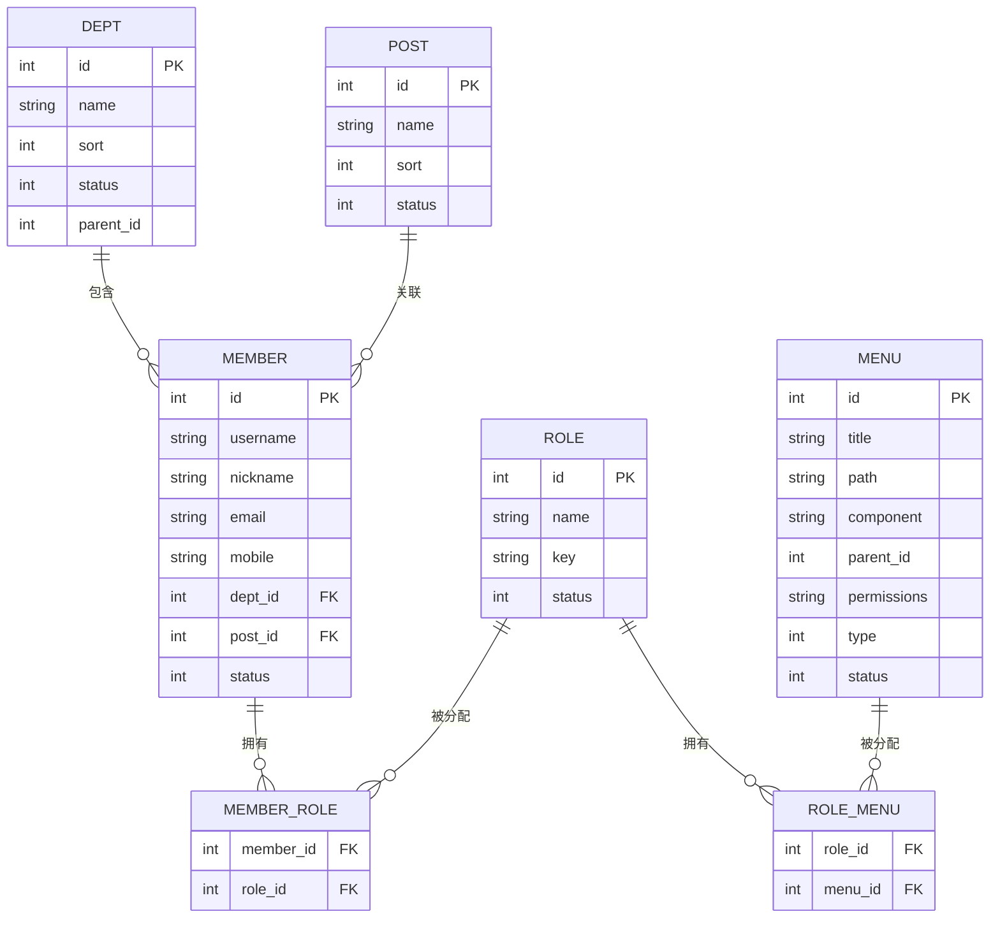
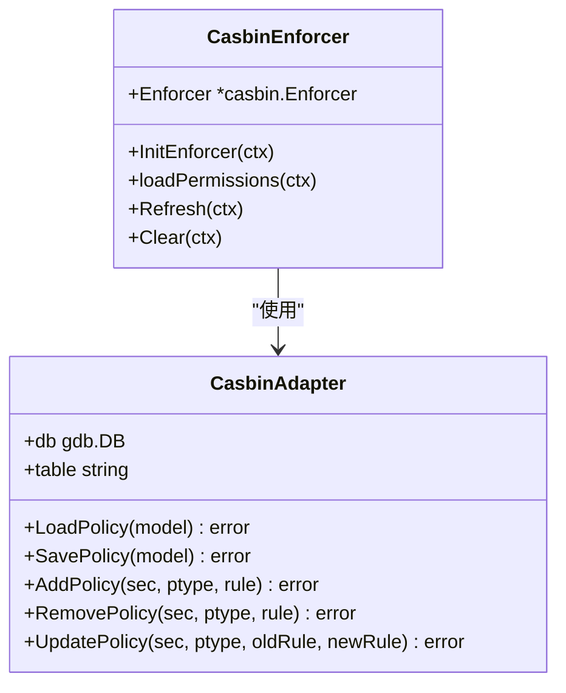
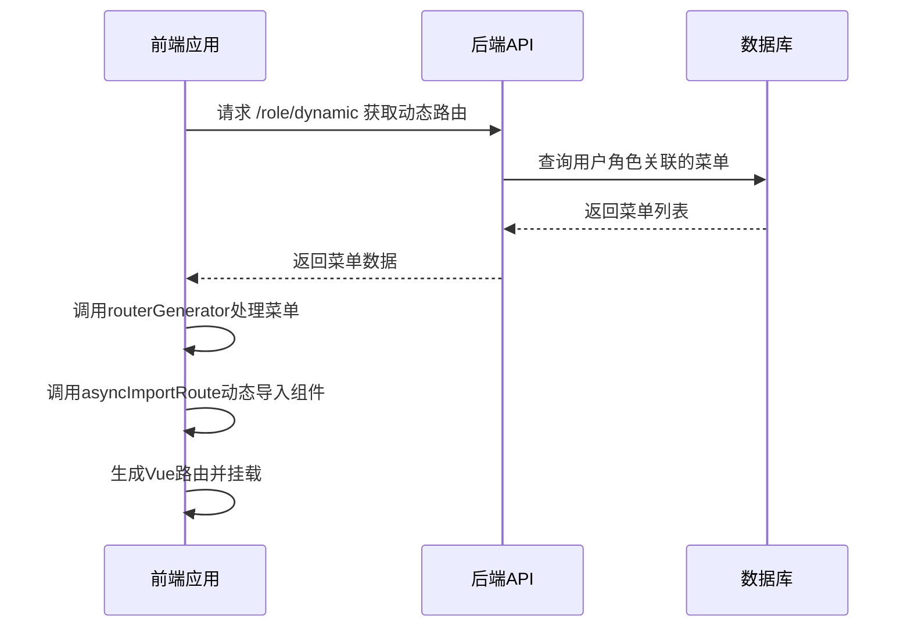
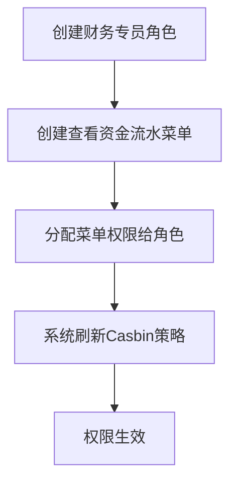

# 用户与权限管理

<cite>
**本文档引用文件**   
- [admin_dept.go](file://server/internal/dao/admin_dept.go)
- [admin_member.go](file://server/internal/dao/admin_member.go)
- [admin_post.go](file://server/internal/dao/admin_post.go)
- [admin_role.go](file://server/internal/dao/admin_role.go)
- [admin_menu.go](file://server/internal/dao/admin_menu.go)
- [admin_role_casbin.go](file://server/internal/dao/admin_role_casbin.go)
- [admin_role_menu.go](file://server/internal/dao/admin_role_menu.go)
- [casbin.conf](file://server/manifest/config/casbin.conf)
- [adapter.go](file://server/internal/library/casbin/adapter.go)
- [enforcer.go](file://server/internal/library/casbin/enforcer.go)
- [dept.go](file://server/api/admin/dept/dept.go)
- [member.go](file://server/api/admin/member/member.go)
- [role.go](file://server/api/admin/role/role.go)
- [menu.go](file://server/api/admin/menu/menu.go)
- [generator-routers.ts](file://web/src/router/generator-routers.ts)
</cite>

## 目录
1. [简介](#简介)
2. [数据模型关系](#数据模型关系)
3. [基于Casbin的RBAC权限模型](#基于casbin的rbac权限模型)
4. [前端动态菜单生成](#前端动态菜单生成)
5. [API接口文档](#api接口文档)
6. [权限分配示例](#权限分配示例)
7. [数据权限实现思路](#数据权限实现思路)

## 简介
本系统实现了完整的用户与权限管理体系，采用基于Casbin的RBAC（基于角色的访问控制）模型。系统通过部门、岗位、用户、角色和菜单的多维度关联，实现了灵活的权限控制机制。权限策略持久化存储于数据库，并通过动态加载机制确保实时生效。前端根据用户角色动态生成可访问菜单，实现界面级权限控制。

## 数据模型关系



**图示来源**
- [admin_dept.go](file://server/internal/dao/admin_dept.go#L1-L22)
- [admin_member.go](file://server/internal/dao/admin_member.go#L1-L22)
- [admin_post.go](file://server/internal/dao/admin_post.go#L1-L22)
- [admin_role.go](file://server/internal/dao/admin_role.go#L1-L22)
- [admin_menu.go](file://server/internal/dao/admin_menu.go#L1-L22)
- [admin_role_menu.go](file://server/internal/dao/admin_role_menu.go#L1-L22)
- [admin_member_role.go](file://server/internal/dao/admin_member_role.go#L1-L22)

**本节来源**
- [admin_dept.go](file://server/internal/dao/admin_dept.go#L1-L22)
- [admin_member.go](file://server/internal/dao/admin_member.go#L1-L22)
- [admin_post.go](file://server/internal/dao/admin_post.go#L1-L22)
- [admin_role.go](file://server/internal/dao/admin_role.go#L1-L22)
- [admin_menu.go](file://server/internal/dao/admin_menu.go#L1-L22)

## 基于Casbin的RBAC权限模型

### 权限策略存储
系统使用 `sys_role_casbin` 表存储Casbin权限策略，该表结构由 `admin_role_casbin.go` 定义，包含 `p_type`、`v0`-`v5` 等字段，对应Casbin策略的各个维度。



**图示来源**
- [adapter.go](file://server/internal/library/casbin/adapter.go#L1-L311)
- [enforcer.go](file://server/internal/library/casbin/enforcer.go#L1-L164)

### 权限加载与匹配过程
1. **初始化**：`InitEnforcer` 函数从 `manifest/config/casbin.conf` 加载模型配置
2. **策略加载**：`loadPermissions` 函数从角色和菜单关联表中读取权限数据
3. **策略构建**：将角色Key、菜单权限和HTTP方法（GET|POST|PUT|DELETE等）构建成策略规则
4. **权限验证**：通过 `Enforcer.Enforce(sub, obj, act)` 进行权限匹配

Casbin配置文件定义了请求定义、策略定义、角色定义、策略效果和匹配器：
```conf
[request_definition]
r = sub, obj, act

[policy_definition]
p = sub, obj, act

[role_definition]
g = _, _

[policy_effect]
e = some(where (p.eft == allow))

[matchers]
m = g(r.sub, p.sub) && keyMatch(r.obj, p.obj) && regexMatch(r.act, p.act)
```

**本节来源**
- [casbin.conf](file://server/manifest/config/casbin.conf#L1-L14)
- [adapter.go](file://server/internal/library/casbin/adapter.go#L1-L311)
- [enforcer.go](file://server/internal/library/casbin/enforcer.go#L1-L164)

## 前端动态菜单生成



前端通过 `generator-routers.ts` 中的 `generatorDynamicRouter` 函数实现动态路由生成：
1. 调用 `adminMenus()` API获取菜单数据
2. 使用 `routerGenerator` 递归处理菜单结构，生成路由
3. 通过 `asyncImportRoute` 动态导入Vue组件
4. 过滤隐藏菜单（type=3或hidden=true）

**图示来源**
- [generator-routers.ts](file://web/src/router/generator-routers.ts#L1-L151)

**本节来源**
- [generator-routers.ts](file://web/src/router/generator-routers.ts#L1-L151)
- [role.go](file://server/api/admin/role/role.go#L1-L82)

## API接口文档

### 用户管理接口
| 接口 | 方法 | 路径 | 功能 |
|------|------|------|------|
| 获取用户列表 | GET | /member/list | 分页查询用户列表 |
| 获取用户信息 | GET | /member/view | 获取指定用户信息 |
| 修改/新增用户 | POST | /member/edit | 创建或更新用户 |
| 删除用户 | POST | /member/delete | 删除指定用户 |
| 更新用户状态 | POST | /member/status | 修改用户启用状态 |
| 获取登录用户信息 | GET | /member/info | 获取当前登录用户详细信息 |

### 角色管理接口
| 接口 | 方法 | 路径 | 功能 |
|------|------|------|------|
| 获取角色列表 | GET | /role/list | 分页查询角色列表 |
| 获取动态路由 | GET | /role/dynamic | 获取当前用户可访问的动态路由 |
| 编辑角色菜单权限 | POST | /role/updatePermissions | 设置角色的菜单权限 |
| 获取角色权限 | GET | /role/getPermissions | 查询指定角色的权限配置 |
| 修改数据权限 | POST | /role/dataScope/edit | 设置角色的数据权限范围 |

### 菜单管理接口
| 接口 | 方法 | 路径 | 功能 |
|------|------|------|------|
| 获取菜单列表 | GET | /menu/list | 查询菜单树结构 |
| 修改/新增菜单 | POST | /menu/edit | 创建或更新菜单项 |
| 删除菜单 | POST | /menu/delete | 删除指定菜单 |

### 部门管理接口
| 接口 | 方法 | 路径 | 功能 |
|------|------|------|------|
| 获取部门列表 | GET | /dept/list | 查询部门树结构 |
| 获取部门选项 | GET | /dept/option | 获取可选部门列表 |
| 获取部门树选项 | GET | /dept/treeOption | 获取部门关系树 |

**本节来源**
- [member.go](file://server/api/admin/member/member.go#L1-L138)
- [role.go](file://server/api/admin/role/role.go#L1-L82)
- [menu.go](file://server/api/admin/menu/menu.go#L1-L39)
- [dept.go](file://server/api/admin/dept/dept.go#L1-L75)

## 权限分配示例

### 为"财务专员"角色分配"查看资金流水"权限
1. **创建角色**：通过 `/role/edit` 接口创建名为"财务专员"的角色，设置唯一Key（如：finance_specialist）
2. **创建菜单**：通过 `/menu/edit` 接口创建"查看资金流水"菜单项，设置权限标识（如：/cash/list）
3. **分配权限**：调用 `/role/updatePermissions` 接口，将"查看资金流水"菜单分配给"财务专员"角色
4. **验证权限**：系统自动调用 `Refresh()` 重新加载权限，新分配的权限立即生效



**本节来源**
- [role.go](file://server/api/admin/role/role.go#L1-L82)
- [menu.go](file://server/api/admin/menu/menu.go#L1-L39)
- [enforcer.go](file://server/internal/library/casbin/enforcer.go#L1-L164)

## 数据权限实现思路

系统通过 `DataScopeSelectReq` 和 `DataScopeEditReq` 接口实现数据权限控制：
1. **数据权限选项**：`/role/dataScope/select` 接口返回预定义的数据权限范围选项
2. **数据权限分配**：`/role/dataScope/edit` 接口允许为角色设置数据访问范围
3. **权限应用**：在数据查询逻辑中，根据用户角色的数据权限范围动态添加查询条件

数据权限的具体实现依赖于 `consts.GroupScopeSelect` 枚举定义，可能包含：
- 本人数据
- 本部门数据
- 本部门及子部门数据
- 全部数据
- 自定义范围

**本节来源**
- [role.go](file://server/api/admin/role/role.go#L1-L82)
- [consts.go](file://server/internal/consts/role.go#L1-L10) (推断存在)