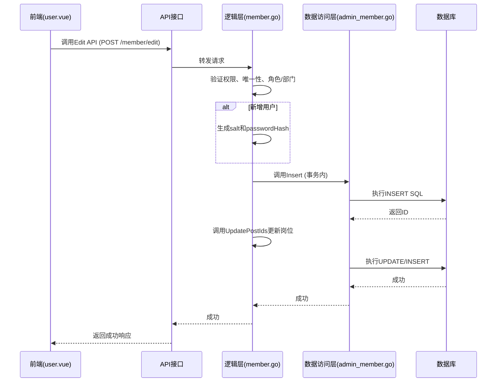
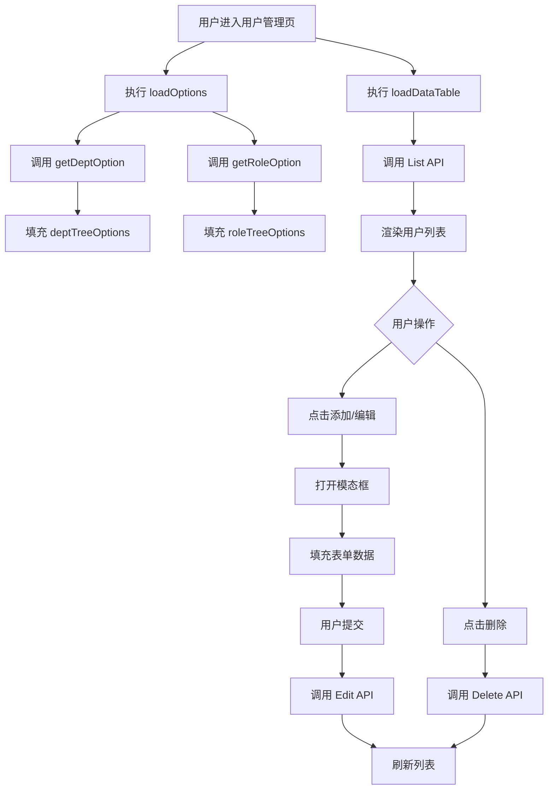

# 用户管理

<cite>
**本文档引用的文件**  
- [admin_member.go](file://server/internal/model/entity/admin_member.go)
- [admin_member.go](file://server/internal/dao/internal/admin_member.go)
- [member.go](file://server/internal/logic/admin/member.go)
- [user.ts](file://web/src/api/org/user.ts)
- [list.vue](file://web/src/views/org/user/list.vue)
- [model.ts](file://web/src/views/org/user/model.ts)
- [columns.ts](file://web/src/views/org/user/columns.ts)
</cite>

## 目录
1. [用户实体与数据库表结构](#用户实体与数据库表结构)  
2. [核心操作流程](#核心操作流程)  
3. [前端交互实现](#前端交互实现)  
4. [创建用户并分配角色示例](#创建用户并分配角色示例)  
5. [密码加密存储机制](#密码加密存储机制)  
6. [API请求与响应示例](#api请求与响应示例)

## 用户实体与数据库表结构

用户管理功能的核心是 `admin_member` 表，其对应的 Go 语言实体为 `AdminMember`。该表存储了后台管理员的所有信息，主要字段定义如下：

| 字段名 | 数据类型 | 描述 |
|--------|----------|------|
| `id` | int64 | 管理员ID，主键 |
| `username` | string | 登录账号，唯一 |
| `realName` | string | 真实姓名 |
| `passwordHash` | string | 密码哈希值 |
| `salt` | string | 密码盐值 |
| `deptId` | int64 | 所属部门ID |
| `roleId` | int64 | 绑定角色ID |
| `status` | int | 用户状态（1: 正常, 2: 禁用） |
| `mobile` | string | 手机号码 |
| `email` | string | 邮箱地址 |
| `avatar` | string | 头像URL |
| `sex` | int | 性别（1: 男, 2: 女） |
| `createdAt` | *gtime.Time | 创建时间 |
| `updatedAt` | *gtime.Time | 更新时间 |

用户与角色的关系通过中间表 `admin_member_role` 维护，该表包含 `member_id` 和 `role_id` 两个外键字段，实现多对多关系。

**Section sources**
- [admin_member.go](file://server/internal/model/entity/admin_member.go#L0-L42)
- [admin_member.go](file://server/internal/dao/internal/admin_member.go#L53-L98)

## 核心操作流程

用户管理的核心操作包括创建、编辑、删除、启用/禁用等，其调用链从API接口贯穿至DAO层。

### 创建/编辑用户流程
1.  **前端调用**：前端通过 `Edit` API 发送用户数据。
2.  **API层**：`member.go` 控制器接收请求并转发给逻辑层。
3.  **逻辑层**：`member.go` 的 `Edit` 方法处理业务逻辑：
    *   验证用户权限（`FilterAuthModel`）。
    *   检查用户名、邮箱、手机号的唯一性（`VerifyUnique`）。
    *   验证角色和部门ID的有效性。
    *   如果是新增用户，生成密码盐（`grand.S(6)`）和密码哈希（`gmd5.MustEncryptString(password + salt)`），并生成邀请码。
    *   使用事务（`g.DB().Transaction`）将数据插入 `hg_admin_member` 表。
    *   调用 `AdminMemberPost().UpdatePostIds` 更新用户岗位信息。
4.  **DAO层**：`admin_member.go` DAO 提供 `InsertAndGetId` 和 `Update` 方法，直接操作数据库。

### 删除用户流程
1.  **前端调用**：前端通过 `Delete` API 发送删除请求。
2.  **逻辑层**：`member.go` 的 `Delete` 方法：
    *   检查用户权限和是否存在。
    *   禁止删除超级管理员账号。
    *   检查该用户是否有下级用户，如有则禁止删除。
    *   在事务中执行删除操作，同时删除 `admin_member` 表中的记录和 `admin_member_post` 表中的关联记录。

### 启用/禁用用户流程
1.  **前端调用**：前端通过 `Status` API 发送状态变更请求。
2.  **逻辑层**：`member.go` 的 `Status` 方法：
    *   检查是否为超级管理员，禁止修改其状态。
    *   调用 `Update` 方法更新 `status` 字段。



**Diagram sources**
- [member.go](file://server/internal/logic/admin/member.go#L300-L450)
- [user.ts](file://web/src/api/org/user.ts#L10-L15)

**Section sources**
- [member.go](file://server/internal/logic/admin/member.go#L300-L450)

## 前端交互实现

前端通过 `user.vue` 组件实现用户管理界面，其交互流程如下：

### 组件结构
*   **`list.vue`**：主页面，包含搜索表单、用户列表和操作模态框。
*   **`model.ts`**：定义表单数据模型（`defaultState`）和验证规则。
*   **`columns.ts`**：定义表格列的配置，包括字段、宽度和渲染函数（如状态标签、头像显示）。
*   **`user.ts`**：API服务层，封装了所有与用户管理相关的HTTP请求。

### 数据流与交互
1.  **初始化**：组件加载时，`loadOptions` 函数调用 `getDeptOption` 和 `getRoleOption` 获取部门和角色的下拉选项，并存储在 `deptTreeOptions` 和 `roleTreeOptions` 中。
2.  **加载列表**：`loadDataTable` 函数调用 `List` API，将分页、搜索条件作为参数发送，获取用户列表数据。
3.  **添加/编辑用户**：
    *   点击“添加用户”按钮，打开模态框，表单数据初始化为 `defaultState`。
    *   点击“编辑”按钮，将选中行的数据 `cloneDeep` 到表单中。
    *   用户填写表单后，点击“确定”，`confirmForm` 函数触发 `Edit` API 调用。
4.  **批量操作**：通过 `checkedIds` 数组记录选中的用户ID，实现批量删除等功能。



**Diagram sources**
- [list.vue](file://web/src/views/org/user/list.vue#L238-L281)
- [model.ts](file://web/src/views/org/user/model.ts#L190-L236)
- [user.ts](file://web/src/api/org/user.ts#L1-L73)

**Section sources**
- [list.vue](file://web/src/views/org/user/list.vue#L0-L526)
- [model.ts](file://web/src/views/org/user/model.ts#L0-L237)
- [columns.ts](file://web/src/views/org/user/columns.ts#L0-L147)

## 创建用户并分配角色示例

1.  **进入界面**：管理员登录后台，导航至“组织管理” -> “用户管理”。
2.  **点击添加**：点击“添加用户”按钮，弹出新建用户模态框。
3.  **填写基本信息**：
    *   **用户名**：输入唯一的登录账号，如 `zhangsan`。
    *   **密码**：输入初始密码。
    *   **姓名**：输入真实姓名，如 `张三`。
    *   **手机号/邮箱**：填写联系方式。
4.  **分配角色与部门**：
    *   在“所属部门”下拉框中，选择用户所属的部门（如“技术部”）。
    *   在“绑定角色”下拉框中，选择一个或多个角色（如“开发工程师”、“测试员”）。
5.  **设置其他信息**：可选择性填写性别、头像、备注等。
6.  **提交**：点击“确定”按钮。
7.  **后端处理**：后端接收到请求后，验证数据，生成密码哈希，将用户信息存入 `admin_member` 表，并在 `admin_member_role` 表中建立用户与角色的关联。
8.  **完成**：前端收到成功响应，关闭模态框并刷新用户列表，新用户 `zhangsan` 出现在列表中。

## 密码加密存储机制

系统采用安全的密码存储方案，防止明文密码泄露。

1.  **生成盐值**：当创建新用户时，系统调用 `grand.S(6)` 生成一个6位的随机字符串作为盐值（`salt`），并存储在 `admin_member` 表中。
2.  **哈希计算**：将用户输入的明文密码与生成的盐值拼接，然后使用 `gmd5.MustEncryptString(password + salt)` 进行MD5哈希计算，得到 `passwordHash`。
3.  **存储**：仅将 `passwordHash` 和 `salt` 存储在数据库中，绝不存储明文密码。
4.  **验证登录**：用户登录时，系统根据用户名查出其 `salt`，然后将用户输入的密码与查出的 `salt` 拼接并进行MD5哈希，最后将计算出的哈希值与数据库中的 `passwordHash` 进行比对，一致则登录成功。

此方案确保了即使数据库泄露，攻击者也无法直接获取用户密码。

**Section sources**
- [member.go](file://server/internal/logic/admin/member.go#L300-L350)

## API请求与响应示例

### 创建/编辑用户 (POST /member/edit)

**请求示例**:
```json
{
  "id": 0,
  "username": "lisi",
  "password": "123456",
  "realName": "李四",
  "deptId": 2,
  "roleId": 3,
  "mobile": "13800138000",
  "email": "lisi@example.com",
  "sex": 1,
  "status": 1
}
```

**成功响应示例**:
```json
{
  "code": 0,
  "message": "操作成功",
  "data": {}
}
```

### 获取用户列表 (GET /member/list)

**请求示例**:
```http
GET /member/list?page=1&perPage=10&username=zhang
```

**成功响应示例**:
```json
{
  "code": 0,
  "message": "获取成功",
  "data": {
    "list": [
      {
        "id": 1,
        "username": "zhangsan",
        "realName": "张三",
        "deptName": "技术部",
        "roleName": "开发工程师",
        "mobile": "13800138001",
        "email": "zhangsan@example.com",
        "status": 1,
        "lastActiveAt": "2023-10-27 10:30:00",
        "createdAt": "2023-10-27 09:00:00"
      }
    ],
    "totalCount": 1
  }
}
```

### 启用/禁用用户 (POST /member/status)

**请求示例**:
```json
{
  "id": 1,
  "status": 2
}
```

**成功响应示例**:
```json
{
  "code": 0,
  "message": "更新用户状态成功",
  "data": {}
}
```

**Section sources**
- [user.ts](file://web/src/api/org/user.ts#L10-L40)