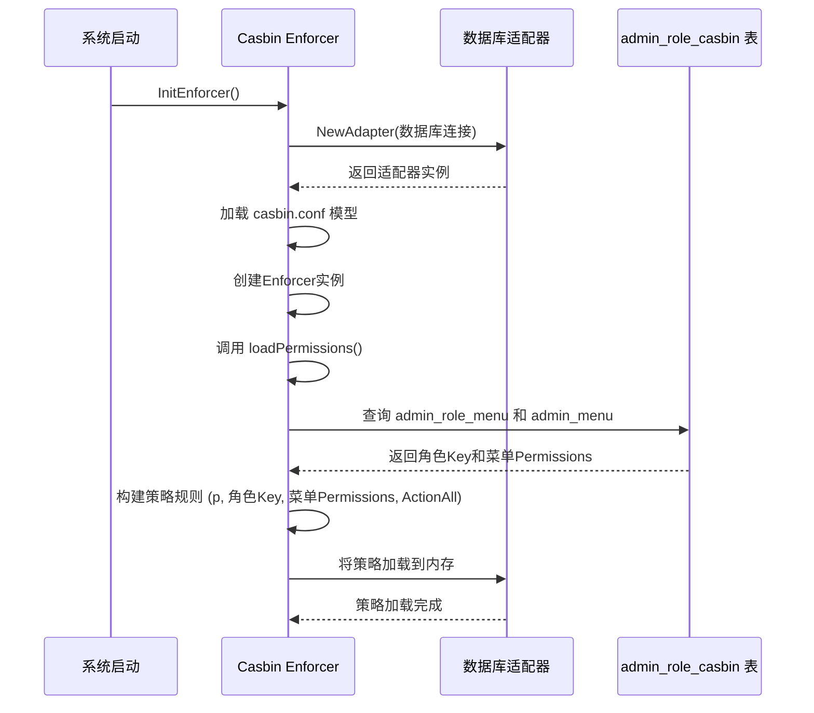

# 角色与菜单权限

<cite>
**本文档引用的文件**  
- [admin_role_casbin.go](file://server/internal/dao/admin_role_casbin.go)
- [admin_role_casbin.go](file://server/internal/model/entity/admin_role_casbin.go)
- [enforcer.go](file://server/internal/library/casbin/enforcer.go)
- [adapter.go](file://server/internal/library/casbin/adapter.go)
- [role.go](file://server/internal/logic/admin/role.go)
- [menu.go](file://server/internal/logic/admin/menu.go)
- [role.vue](file://web/src/views/permission/role/role.vue)
- [menu.vue](file://web/src/views/permission/menu/menu.vue)
</cite>

## 目录
1. [简介](#简介)
2. [数据库表结构与关系](#数据库表结构与关系)
3. [Casbin权限模型与Enforcer机制](#casbin权限模型与enforcer机制)
4. [前端组件协同工作流程](#前端组件协同工作流程)
5. [具体示例：创建“审核员”角色](#具体示例：创建“审核员”角色)
6. [按钮级别权限控制实现](#按钮级别权限控制实现)

## 简介
本文档详细介绍了基于Casbin的RBAC（基于角色的访问控制）权限模型在hotgo-2.0项目中的实现。重点阐述了`admin_role`、`admin_menu`和`admin_role_casbin`三张核心数据表之间的关系，以及Casbin Enforcer如何在运行时加载策略并进行权限校验。同时，文档描述了前端`role.vue`和`menu.vue`组件如何协同工作，完成角色与菜单权限的配置，并通过具体示例说明了如何创建一个具有特定权限的角色。

## 数据库表结构与关系

在hotgo-2.0系统中，权限管理主要依赖于三张数据库表：`admin_role`（角色表）、`admin_menu`（菜单表）和`admin_role_casbin`（Casbin权限策略表）。它们之间的关系构成了RBAC模型的核心。

- `admin_role` 表存储了系统中所有角色的基本信息，如角色ID、名称、编码（Key）等。
- `admin_menu` 表存储了系统中所有菜单项的信息，包括菜单的路径（Path）、名称、标题以及**权限标识（Permissions）**。
- `admin_role_casbin` 表是Casbin策略的持久化存储，它不直接存储角色与菜单的关联，而是存储由角色、菜单路径和HTTP方法组成的权限策略。

角色与菜单的直接关联是通过一个中间表`admin_role_menu`来实现的。当管理员在角色编辑页面为某个角色勾选了多个菜单权限后，系统会将这些`角色ID`和`菜单ID`的对应关系写入`admin_role_menu`表。

**Section sources**
- [admin_role_casbin.go](file://server/internal/model/entity/admin_role_casbin.go#L7-L16)

## Casbin权限模型与Enforcer机制

Casbin是一个强大的、高效的开源访问控制框架，支持多种访问控制模型，如ACL、RBAC、ABAC等。在本项目中，使用的是RBAC模型。

### Casbin Enforcer初始化与策略加载

系统启动时，会调用`InitEnforcer`函数来初始化Casbin Enforcer。该函数主要完成以下工作：
1.  **创建适配器(Adapter)**：通过`NewAdapter`函数，使用数据库连接信息创建一个适配器，该适配器负责与`admin_role_casbin`表进行交互。
2.  **加载模型(Model)**：从`manifest/config/casbin.conf`文件中读取Casbin的模型配置，该配置定义了系统的权限规则（如`p = sub, obj, act`）。
3.  **创建Enforcer**：结合模型和适配器，创建一个`casbin.Enforcer`实例。
4.  **加载权限策略**：调用`loadPermissions`函数，从数据库中读取所有有效的角色-菜单权限映射，并将其转换为Casbin的策略规则，加载到内存中。



**Diagram sources**
- [enforcer.go](file://server/internal/library/casbin/enforcer.go#L33-L33)
- [enforcer.go](file://server/internal/library/casbin/enforcer.go#L50-L100)
- [adapter.go](file://server/internal/library/casbin/adapter.go#L100-L150)

### 运行时权限校验

当用户发起一个HTTP请求时，后端的权限中间件会调用`casbin.Enforcer.Enforce`方法进行权限校验。其调用形式为`e.Enforce(sub, obj, act)`，其中：
- `sub` (Subject): 代表主体，即当前登录用户的角色Key（`user.RoleKey`）。
- `obj` (Object): 代表客体，即请求的资源，通常是API的路径（`path`）。
- `act` (Action): 代表操作，即HTTP请求方法（`method`），如GET、POST等。

Enforcer会根据内存中加载的策略规则，检查是否存在一条规则允许`sub`对`obj`执行`act`操作。如果存在，则返回`true`，表示校验通过；否则返回`false`。

**Section sources**
- [enforcer.go](file://server/internal/library/casbin/enforcer.go#L33-L33)
- [role.go](file://server/internal/logic/admin/role.go#L40-L50)

## 前端组件协同工作流程

前端通过`role.vue`和`menu.vue`两个组件协同工作，实现了角色与菜单权限的可视化配置。

### 角色管理 (role.vue)

`role.vue`组件是角色管理的主界面。它展示了所有角色的列表，并提供了“添加”、“编辑”、“删除”以及“菜单权限”等操作按钮。

```mermaid
flowchart TD
A[角色管理页面 role.vue] --> B[点击 "菜单权限" 按钮]
B --> C[打开 "编辑菜单权限" 弹窗]
C --> D[加载所有菜单树]
D --> E[根据角色ID查询已授权菜单]
E --> F[在菜单树上勾选已授权项]
F --> G[用户勾选/取消勾选菜单]
G --> H[点击 "提交"]
H --> I[收集选中的菜单ID数组]
I --> J[调用 /role/updatePermissions API]
```

**Diagram sources**
- [role.vue](file://web/src/views/permission/role/role.vue#L1-L153)

### 菜单管理 (menu.vue)

`menu.vue`组件负责管理系统的菜单结构。它以树形结构展示所有菜单，并允许管理员添加、编辑和删除菜单项。每个菜单项的编辑表单中都包含一个“权限标识”字段，这是权限校验的关键。

**Section sources**
- [menu.vue](file://web/src/views/permission/menu/menu.vue#L1-L194)

### 权限数据提交流程

当管理员在`role.vue`的“编辑菜单权限”弹窗中完成菜单选择并点击提交后，前端会执行以下流程：
1.  **收集数据**：将选中的菜单ID数组和当前角色的ID收集起来。
2.  **调用API**：通过`/role/updatePermissions`接口，将数据以JSON格式提交给后端。请求体类似于`{roleId: 2, menuIds: [101, 102, 103]}`。
3.  **后端处理**：后端接收到请求后，执行`UpdatePermissions`逻辑：
    -   在数据库事务中，先删除`admin_role_menu`表中该角色ID对应的所有旧权限记录。
    -   然后将新的`角色ID-菜单ID`对批量插入`admin_role_menu`表。
    -   最后，调用`casbin.Refresh(ctx)`函数，该函数会清除内存中的旧策略，并重新从数据库加载最新的权限策略，使新的权限配置立即生效。

**Section sources**
- [role.go](file://server/internal/logic/admin/role.go#L140-L160)
- [role.vue](file://web/src/views/permission/role/role.vue#L100-L120)

## 具体示例：创建“审核员”角色

以下是如何创建一个名为“审核员”的角色，并赋予其访问“内容审核”页面的“查看”和“通过”权限的完整步骤：

1.  **创建角色**：
    -   在`role.vue`页面点击“添加角色”。
    -   填写角色名称为“审核员”，编码为`reviewer`，然后保存。系统会生成一个角色ID（假设为`2`）。

2.  **配置菜单权限**：
    -   在角色列表中找到“审核员”，点击“菜单权限”。
    -   在弹出的菜单树中，找到“内容审核”这个菜单节点（假设其菜单ID为`101`，路径为`/audit/content`）。
    -   勾选“内容审核”菜单节点。
    -   点击“提交”。

3.  **后端策略生成**：
    -   假设“内容审核”菜单的“权限标识”字段配置为`/audit/content`。
    -   后端在`loadPermissions`函数中，会查询到`角色Key=reviewer`和`菜单Permissions=/audit/content`的映射。
    -   系统会生成一条Casbin策略规则：`p, reviewer, /audit/content, GET|POST|PUT|DELETE|PATCH|OPTIONS|HEAD`，并将其加载到Enforcer中。

4.  **权限校验**：
    -   当一个属于“审核员”角色的用户尝试访问`GET /audit/content`或`POST /audit/content/pass`等接口时，权限中间件会调用`e.Enforce("reviewer", "/audit/content", "GET")`或`e.Enforce("reviewer", "/audit/content/pass", "POST")`。
    -   由于策略中允许`reviewer`对`/audit/content`路径执行所有操作，因此校验通过，用户可以正常访问。

## 按钮级别权限控制实现

除了页面级别的访问控制，系统还支持更细粒度的按钮级别权限控制。这通常通过以下方式实现：

1.  **为按钮定义独立的权限标识**：在`admin_menu`表中，可以为同一个菜单下的不同操作按钮定义独立的权限标识。例如，除了`/audit/content`主权限外，还可以定义`/audit/content/view`和`/audit/content/pass`作为“查看”和“通过”按钮的权限标识。

2.  **前端条件渲染**：在前端组件中，使用自定义的权限指令（如`v-permission`）来控制按钮的显示。该指令会接收一个权限标识作为参数。

3.  **权限校验**：当页面加载时，前端会向后端请求当前用户拥有的所有权限列表（`LoginPermissions`）。这个列表包含了用户所有可访问的权限标识。
    -   **Section sources**: [menu.go](file://server/internal/logic/admin/menu.go#L250-L280)

4.  **动态显示**：`v-permission`指令会检查当前用户的权限列表中是否包含该按钮所需的权限标识。如果包含，则显示按钮；否则隐藏或禁用该按钮。

通过这种方式，系统实现了从页面到按钮的精细化权限控制，确保了用户只能看到和操作其被授权的功能。