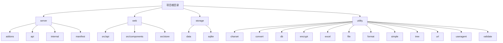

# 目录结构详解

<cite>
**本文档引用的文件**
- [addons.go](file://server/addons/addons.go)
- [member.go](file://server/api/admin/member/member.go)
- [config.yaml](file://server/manifest/config/config.yaml)
- [index.ts](file://web/src/api/base/index.ts)
- [Form/index.ts](file://web/src/components/Form/index.ts)
- [store/index.ts](file://web/src/store/index.ts)
</cite>

## 目录结构

本项目采用前后端分离的架构设计，主要分为 `server`（后端服务）、`web`（前端应用）、`storage`（数据存储）和 `utility`（通用工具）四大核心模块。通过清晰的目录划分，实现了功能解耦与职责分离，便于团队协作开发与维护。

**Diagram sources**
- [server](file://server)
- [web](file://web)
- [storage](file://storage)
- [utility](file://utility)

**Section sources**
- [server](file://server)
- [web](file://web)
- [storage](file://storage)
- [utility](file://utility)

## server 目录

`server` 目录是后端服务的核心，包含了业务逻辑、接口定义、插件系统和部署配置。

### addons（插件）

`server/addons` 目录是系统的插件扩展中心，允许开发者以模块化的方式添加新功能而无需修改核心代码。每个插件（如 `hgexample`）都是一个独立的 Go 包，拥有完整的 MVC 结构（API、Controller、Logic、Model、Router），实现了高内聚低耦合的设计。插件通过 `modules` 目录注册，并由 `addons.go` 统一管理，支持热插拔和独立部署。

**职责说明**：存放所有可插拔的功能模块，实现业务功能的动态扩展。

**Section sources**
- [addons.go](file://server/addons/addons.go)

### api（接口层）

`server/api` 目录定义了所有对外暴露的 HTTP 接口。该目录按业务模块（如 `admin`、`api`、`home`）和功能（如 `member`、`order`、`pay`）进行组织。每个 `.go` 文件通常对应一个资源的 RESTful API 集合，通过 GoFrame 框架的 `g.Meta` 标签声明路由、方法和元信息，实现了接口定义与实现的分离。

**职责说明**：作为系统的门面，集中管理所有 API 端点，负责请求的接收与响应。

**Section sources**
- [member.go](file://server/api/admin/member/member.go)

### internal（核心逻辑）

`server/internal` 目录是应用的核心业务逻辑层，包含了控制器（`controller`）、数据访问对象（`dao`）、业务逻辑（`logic`）、模型（`model`）、服务（`service`）等。`internal` 与 `api` 分离，确保了业务逻辑的纯粹性，不依赖于任何 HTTP 框架。`consts` 目录存放常量，`library` 存放通用库，`router` 管理路由注册。

**职责说明**：实现核心业务规则和数据处理，是系统的大脑。

### manifest（部署）

`server/manifest` 目录存放与部署和环境相关的配置文件。`config` 子目录包含 `config.yaml` 等配置文件，定义了数据库、缓存、日志等运行时参数。`docker` 子目录包含 `Dockerfile` 和启动脚本，用于容器化部署。`deploy/kustomize` 支持 Kubernetes 的声明式配置管理。

**职责说明**：提供系统部署所需的配置和脚本，实现环境一致性。

**Section sources**
- [config.yaml](file://server/manifest/config/config.yaml)

## web 目录

`web` 目录是前端应用的源代码，基于 Vue3 + Vite + TypeScript 构建。

### src/api（前端API调用）

`web/src/api` 目录封装了所有与后端 API 的交互。每个子目录（如 `member`、`order`）对应一个业务模块，其中的 `index.ts` 文件导出使用 `axios` 封装的请求函数。`base` 目录提供基础接口（如验证码、文件上传），`addons` 目录对应后端插件的 API。这种组织方式使得 API 调用清晰、可复用。

**职责说明**：作为前端与后端通信的桥梁，统一管理所有网络请求。

**Section sources**
- [index.ts](file://web/src/api/base/index.ts)

### src/components（UI组件）

`web/src/components` 目录存放可复用的 UI 组件。组件按功能划分（如 `Form`、`Table`、`Upload`），每个组件包含 `.vue` 文件和相关的 TypeScript 定义。`Form` 组件封装了表单的创建、验证和提交逻辑，`Table` 组件提供了分页、排序和操作列等高级功能。这些组件通过 `index.ts` 导出，便于在项目中全局使用。

**职责说明**：提供可复用的视觉和交互元素，构建用户界面。

**Section sources**
- [Form/index.ts](file://web/src/components/Form/index.ts)

### src/store（状态管理）

`web/src/store` 目录使用 Pinia 进行全局状态管理。`modules` 子目录将状态按功能模块拆分（如 `user`、`tabsView`），每个模块管理自己的状态、动作和获取器。`index.ts` 是 Store 的入口，负责创建和安装 Pinia 实例。这种方式避免了状态的全局污染，提高了代码的可维护性。

**职责说明**：集中管理应用的全局状态，实现组件间的数据共享。

**Section sources**
- [store/index.ts](file://web/src/store/index.ts)

## storage 目录

`storage` 目录用于存放持久化数据和脚本。

### 数据库脚本

`storage/data` 目录存放数据库相关的 SQL 脚本。`sqlite` 子目录包含 SQLite 的初始化脚本（`tables.sql`、`data.sql`），`generate` 子目录存放由代码生成器创建的 SQL 文件。`hotgo.sql` 是完整的数据库结构导出文件。这些脚本是系统数据模型的物理体现，确保了数据库结构的版本控制。

**职责说明**：存放数据库初始化和迁移脚本，管理数据层的结构。

## utility 目录

`utility` 目录存放项目中通用的工具函数。

### 通用工具函数

该目录下的每个子目录（如 `convert`、`encrypt`、`file`）都提供特定领域的工具函数。`convert` 处理类型转换，`encrypt` 提供加密解密功能，`file` 管理文件操作，`validate` 负责数据校验。这些工具函数被项目各处复用，减少了代码重复，提高了开发效率。

**职责说明**：提供跨模块的通用功能，是项目的基础工具箱。

## 开发者导航

对于希望参与开发的贡献者，以下是快速定位工作区域的指南：

- **插件开发**：应重点关注 `server/addons` 目录。可以参考 `hgexample` 插件的结构，创建新的插件模块，实现业务功能的扩展。
- **前端组件开发**：应重点关注 `web/src/components` 目录。可以在此创建新的 UI 组件或扩展现有组件，以满足界面需求。

通过理解上述目录结构和职责划分，开发者可以快速融入项目，高效地进行功能开发和维护。