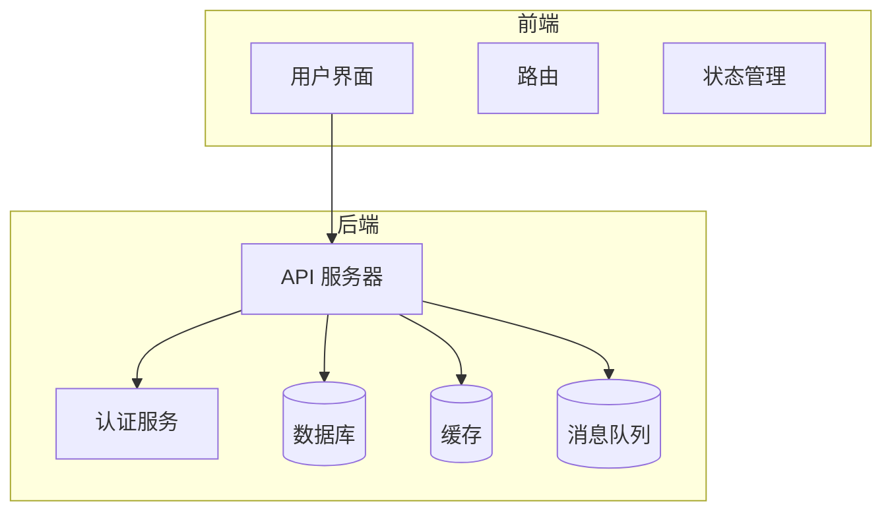

# 系统概述

<cite>
**本文档引用文件**  
- [main.go](file://server/main.go)
- [main.ts](file://web/src/main.ts)
- [README.md](file://README.md)
- [config.yaml](file://server/manifest/config/config.yaml)
- [addons.go](file://server/internal/library/addons/module.go)
- [hggen.go](file://server/internal/library/hggen/hggen.go)
- [sys.go](file://server/internal/service/sys.go)
- [addons.go](file://server/internal/logic/sys/addons.go)
- [hotgo.sql](file://server/storage/data/hotgo.sql)
</cite>

## 目录
1. [项目定位与核心价值](#项目定位与核心价值)
2. [架构设计](#架构设计)
3. [主要功能模块](#主要功能模块)
4. [设计哲学](#设计哲学)
5. [系统整体架构图](#系统整体架构图)
6. [典型使用场景](#典型使用场景)

## 项目定位与核心价值

hotgo-2.0 是一个企业级全栈后台管理框架，旨在为中小型完整应用开发提供高效、可扩展的解决方案。该框架基于 GoFrame2、Vue3、NaiveUI 和 uniapp 技术栈构建，专为二次开发而设计，具备高生产率和极致的可扩展性。通过模块化、插件化机制，开发者可以在几分钟内搭建出一个完整的应用开发骨架，极大地提升了开发效率。

**Section sources**
- [README.md](file://README.md#L0-L39)

## 架构设计

hotgo-2.0 采用前后端分离架构，前端使用 Vue3 和 NaiveUI 构建用户界面，后端使用 GoFrame2 提供 RESTful API 接口。系统支持多应用入口，包括 Admin（后台）、Home（前台页面）、Api（对外通用接口）和 WebSocket（即时通讯接口），不同的业务场景可以进入不同的应用入口。认证机制采用 JWT 进行用户状态认证，并结合 casbin 实现权限认证，确保系统的安全性和灵活性。

**Section sources**
- [main.go](file://server/main.go#L19-L23)
- [main.ts](file://web/src/main.ts#L0-L44)

## 主要功能模块

hotgo-2.0 提供了丰富的内置功能模块，涵盖了企业级应用开发的各个方面：

1. **用户管理**：配置系统用户。
2. **部门管理**：配置组织机构，支持树结构展现和数据权限。
3. **岗位管理**：配置用户职务。
4. **菜单管理**：配置系统菜单和操作权限。
5. **角色管理**：分配角色菜单权限，划分数据范围权限。
6. **字典管理**：维护常用特定数据。
7. **配置管理**：动态配置系统参数。
8. **日志管理**：记录操作日志、登录日志和服务日志。
9. **支付网关**：集成支付宝、微信支付、QQ 支付等多种支付方式。
10. **资金管理**：支持在线充值、退款、提现等功能。
11. **定时任务**：在线调度任务并记录执行结果日志。
12. **代码生成器**：自动生成前后端代码，支持 CURD、树表等常见开发模式。
13. **插件化扩展**：支持一键生成插件模板，每个插件独立开发，互不影响。
14. **消息队列**：兼容 Kafka、Redis、RocketMQ 和磁盘队列，支持一键切换。
15. **实时通信**：基于 WebSocket 实现实时通知推送。

**Section sources**
- [README.md](file://README.md#L53-L75)

## 设计哲学

hotgo-2.0 的设计哲学强调模块化、插件化和高可扩展性。系统采用微核架构，功能隔离，支持渐进式开发和多人协同开发。通过插件化机制，开发者可以轻松创建、安装、更新和卸载插件，而不会对原有系统产生影响。此外，系统支持快速生成代码，开发者只需创建表并进行简单配置即可生成完善的 CURD 开发代码，极大地减少了重复性工作。

**Section sources**
- [README.md](file://README.md#L42-L52)

## 系统整体架构图

**Diagram sources**
- [main.go](file://server/main.go#L19-L23)
- [main.ts](file://web/src/main.ts#L0-L44)

## 典型使用场景

hotgo-2.0 适用于多种典型使用场景，包括但不限于：

- **快速搭建中后台系统**：利用代码生成器和插件化机制，快速构建功能完善的中后台管理系统。
- **多租户应用开发**：通过插件化扩展，支持多租户架构，满足不同客户的需求。
- **企业级应用开发**：提供全面的功能模块和灵活的权限管理，适合复杂的企业级应用开发。

**Section sources**
- [README.md](file://README.md#L53-L75)