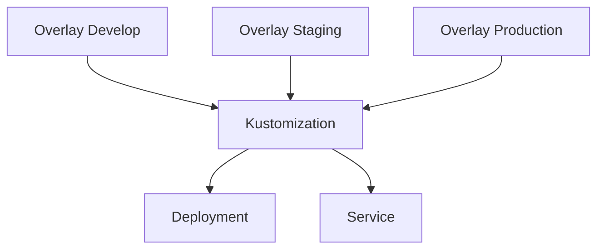
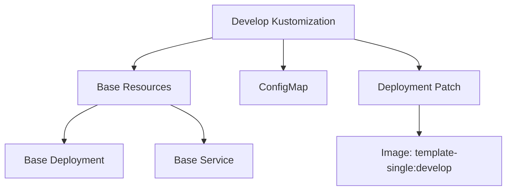

# Kustomize/K8s部署

<cite>
**Referenced Files in This Document**  
- [deployment.yaml](file://server/manifest/deploy/kustomize/base/deployment.yaml)
- [service.yaml](file://server/manifest/deploy/kustomize/base/service.yaml)
- [kustomization.yaml](file://server/manifest/deploy/kustomize/base/kustomization.yaml)
- [configmap.yaml](file://server/manifest/deploy/kustomize/overlays/develop/configmap.yaml)
- [deployment.yaml](file://server/manifest/deploy/kustomize/overlays/develop/deployment.yaml)
- [kustomization.yaml](file://server/manifest/deploy/kustomize/overlays/develop/kustomization.yaml)
</cite>

## 目录
1. [简介](#简介)
2. [基础资源配置](#基础资源配置)
3. [Kustomization文件解析](#kustomization文件解析)
4. [开发环境覆盖配置](#开发环境覆盖配置)
5. [创建新环境覆盖](#创建新环境覆盖)
6. [部署应用](#部署应用)
7. [K8s运维建议](#k8s运维建议)
8. [总结](#总结)

## 简介
本文档深入解析基于Kustomize的Kubernetes部署方案，详细解释基础资源清单的配置项含义，阐述kustomization.yaml文件如何管理资源和生成器，说明如何通过补丁和ConfigMap实现环境差异化配置，并提供K8s部署的运维建议。

## 基础资源配置

### Deployment配置
基础Deployment资源配置定义了应用的基本部署参数。在`server/manifest/deploy/kustomize/base/deployment.yaml`文件中，配置了以下关键参数：

- **副本数(replicas)**: 设置为1，表示该应用将运行一个实例
- **选择器(selector)**: 使用标签`app: template-single`来匹配Pod
- **容器配置**: 定义了一个名为`main`的容器，使用`template-single`镜像，镜像拉取策略为`Always`

该配置为所有环境提供了统一的部署基础。

**Section sources**
- [deployment.yaml](file://server/manifest/deploy/kustomize/base/deployment.yaml#L1-L22)

### Service配置
基础Service资源配置定义了应用的网络访问方式。在`server/manifest/deploy/kustomize/base/service.yaml`文件中，配置了以下关键参数：

- **端口映射**: 将服务端口80映射到Pod的8000端口
- **协议**: 使用TCP协议
- **选择器**: 通过`app: template-single`标签选择后端Pod

该配置为应用提供了稳定的网络访问入口。

**Section sources**
- [service.yaml](file://server/manifest/deploy/kustomize/base/service.yaml#L1-L13)

## Kustomization文件解析

### 基础Kustomization
基础kustomization.yaml文件是Kustomize配置的核心，位于`server/manifest/deploy/kustomize/base/kustomization.yaml`。该文件定义了：

- **API版本**: 使用`kustomize.config.k8s.io/v1beta1`
- **资源列表**: 包含`deployment.yaml`和`service.yaml`两个基础资源文件
- **构建规则**: Kustomize将这些资源文件合并并生成最终的部署清单

该文件作为所有环境配置的基础，通过继承机制实现配置复用。



**Diagram sources**
- [kustomization.yaml](file://server/manifest/deploy/kustomize/base/kustomization.yaml#L1-L9)

**Section sources**
- [kustomization.yaml](file://server/manifest/deploy/kustomize/base/kustomization.yaml#L1-L9)

## 开发环境覆盖配置

### ConfigMap覆盖
开发环境通过ConfigMap实现配置覆盖，位于`server/manifest/deploy/kustomize/overlays/develop/configmap.yaml`。该文件定义了：

- **配置数据**: 包含服务器地址、OpenAPI路径、Swagger路径等
- **日志级别**: 设置为"all"，便于开发调试
- **标准输出**: 启用stdout，方便查看日志

这些配置通过ConfigMap注入到应用中，实现环境特定的配置管理。

**Section sources**
- [configmap.yaml](file://server/manifest/deploy/kustomize/overlays/develop/configmap.yaml#L1-L15)

### Deployment补丁
开发环境通过战略合并补丁（Strategic Merge Patch）修改基础Deployment配置，位于`server/manifest/deploy/kustomize/overlays/develop/deployment.yaml`。该补丁主要修改了：

- **镜像标签**: 将镜像从`template-single`修改为`template-single:develop`，指向开发版本
- **容器配置**: 保持其他配置与基础版本一致

这种补丁机制允许在不修改基础配置的情况下，实现环境特定的变更。

**Section sources**
- [deployment.yaml](file://server/manifest/deploy/kustomize/overlays/develop/deployment.yaml#L1-L10)

### 开发环境Kustomization
开发环境的kustomization.yaml文件位于`server/manifest/deploy/kustomize/overlays/develop/kustomization.yaml`，定义了：

- **基础资源**: 继承自`../../base`目录的基础配置
- **额外资源**: 添加了`configmap.yaml`作为额外资源
- **补丁策略**: 使用`patchesStrategicMerge`应用`deployment.yaml`补丁
- **命名空间**: 设置为`default`

该配置文件将基础资源与开发环境特定的配置组合在一起，形成完整的开发环境部署清单。



**Diagram sources**
- [kustomization.yaml](file://server/manifest/deploy/kustomize/overlays/develop/kustomization.yaml#L1-L15)

**Section sources**
- [kustomization.yaml](file://server/manifest/deploy/kustomize/overlays/develop/kustomization.yaml#L1-L15)

## 创建新环境覆盖

### 创建Staging环境
要创建Staging环境覆盖，可以按照以下步骤操作：

1. 在`overlays/`目录下创建`staging`子目录
2. 复制`develop`目录的结构作为起点
3. 创建`kustomization.yaml`文件，继承基础配置
4. 根据Staging环境需求创建相应的补丁文件和ConfigMap

### 创建Production环境
Production环境的创建流程与Staging类似，但需要特别注意：

- 镜像标签应指向稳定版本
- 日志级别应设置为适当的生产级别
- 资源限制和请求应根据生产负载进行优化
- 副本数应根据预期流量进行调整

通过这种模式，可以轻松创建和管理多个环境的部署配置。

## 部署应用

### 应用部署命令
使用以下命令应用Kustomize部署：

```bash
kubectl apply -k server/manifest/deploy/kustomize/overlays/develop
```

该命令会：
1. 读取指定目录的kustomization.yaml文件
2. 合并基础资源和覆盖配置
3. 生成最终的Kubernetes资源清单
4. 应用到集群中

### 部署验证
部署后，可以通过以下命令验证部署状态：

```bash
kubectl get pods -l app=template-single
kubectl get services template-single
kubectl get configmap template-single-configmap
```

## K8s运维建议

### 滚动更新策略
建议在Deployment配置中添加滚动更新策略，确保应用更新时的高可用性：

```yaml
spec:
  strategy:
    type: RollingUpdate
    rollingUpdate:
      maxSurge: 1
      maxUnavailable: 0
```

这可以确保在更新过程中始终有可用的Pod实例。

### 监控指标暴露
建议配置Prometheus监控，通过以下方式暴露指标：

- 在应用中集成Prometheus客户端库
- 配置Service暴露metrics端口
- 添加相应的ServiceMonitor资源

### 日志收集
建议采用集中式日志收集方案：

- 使用Fluentd或Filebeat收集容器日志
- 将日志发送到Elasticsearch进行存储
- 使用Kibana进行日志查询和可视化

同时，建议在生产环境中合理设置日志级别，避免产生过多日志数据。

## 总结
本文档详细解析了基于Kustomize的Kubernetes部署方案，从基础资源配置到环境覆盖，再到部署和运维建议。通过Kustomize的继承和补丁机制，可以有效地管理多环境的Kubernetes部署，实现配置的复用和差异化管理。