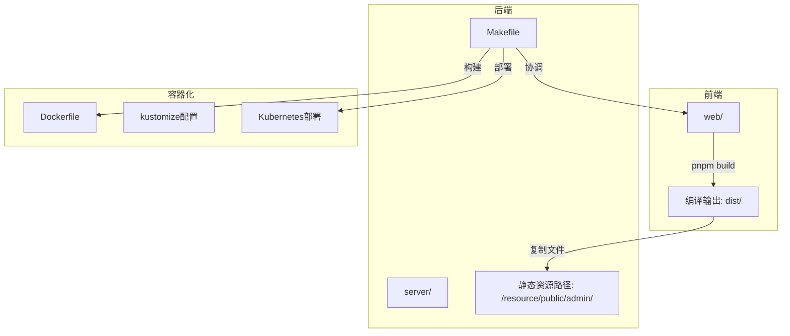
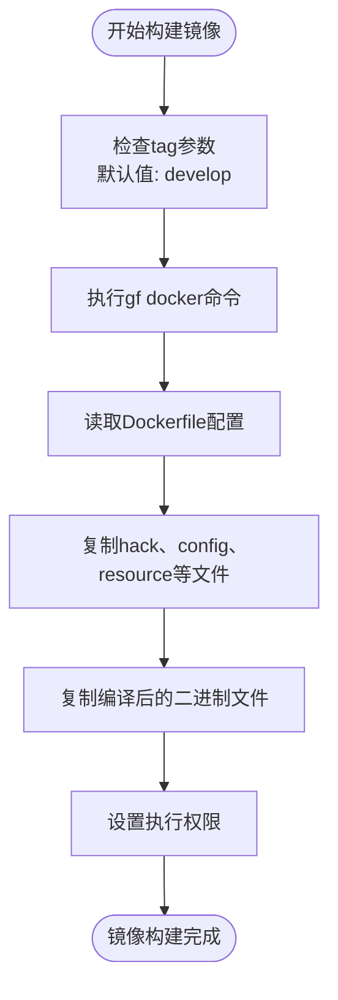
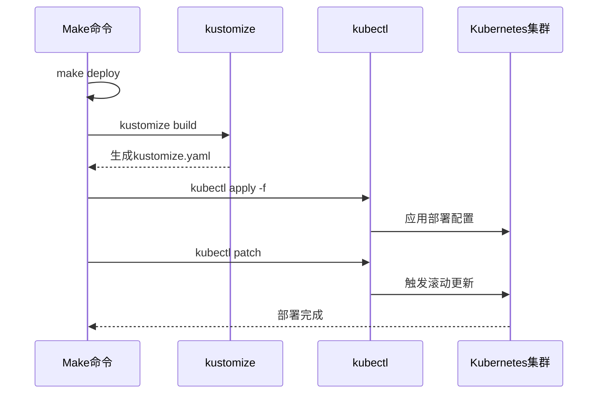
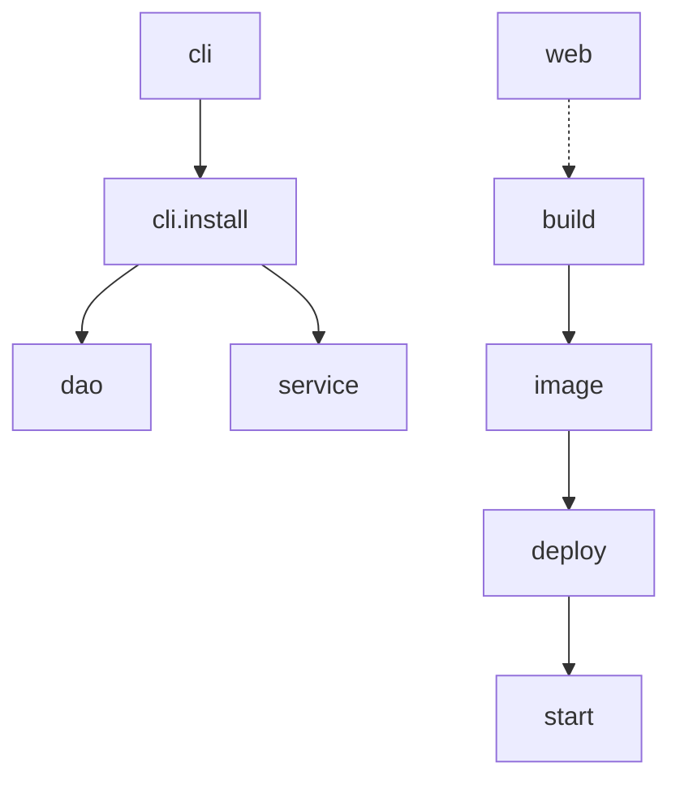

# Makefile操作指南

<cite>
**本文档引用的文件**
- [Makefile](file://server/Makefile)
- [Dockerfile](file://server/manifest/docker/Dockerfile)
- [docker.sh](file://server/manifest/docker/docker.sh)
- [entrypoint.sh](file://server/manifest/docker/entrypoint.sh)
</cite>

## 目录
1. [简介](#简介)
2. [项目结构](#项目结构)
3. [核心构建命令](#核心构建命令)
4. [Docker相关命令](#docker相关命令)
5. [部署与运维命令](#部署与运维命令)
6. [辅助开发命令](#辅助开发命令)
7. [变量定义与依赖关系](#变量定义与依赖关系)
8. [扩展Makefile](#扩展makefile)

## 简介
本指南全面介绍`hotgo-2.0`项目中Makefile提供的自动化命令。该Makefile位于`server/`目录下，为开发者提供了一套完整的本地构建、镜像打包和环境部署的自动化流程。通过封装复杂的Docker和Kubectl操作，简化了开发和部署流程，提高了开发效率。

**Section sources**
- [Makefile](file://server/Makefile#L1-L114)

## 项目结构
项目采用前后端分离架构，包含两个主要模块：
- `server/`：后端Go服务，包含核心业务逻辑、API接口和数据库操作
- `web/`：前端Vue应用，负责用户界面展示和交互

Makefile位于`server/`目录下，主要协调前后端的构建流程，并处理容器化部署相关的操作。



**Diagram sources**
- [Makefile](file://server/Makefile#L1-L114)
- [Dockerfile](file://server/manifest/docker/Dockerfile#L1-L24)

## 核心构建命令

### build目标
`build`目标实现了一键编译功能，自动化完成以下流程：
1. 清理并创建前端资源目录
2. 进入`web/`目录执行前端构建
3. 将构建后的静态文件复制到后端指定路径
4. 执行后端编译

该命令通过调用GoFrame CLI工具完成后端编译，实现了前后端构建的无缝集成。

**Section sources**
- [Makefile](file://server/Makefile#L7-L13)

## Docker相关命令

### docker-build目标
`image`目标负责构建Docker镜像，主要功能包括：
- 使用GoFrame CLI的docker功能进行镜像构建
- 支持通过`tag`参数指定镜像标签
- 自动化处理镜像命名和版本控制

构建过程依赖于`manifest/docker/Dockerfile`，该文件定义了容器的基础环境和启动流程。



**Diagram sources**
- [Makefile](file://server/Makefile#L87-L91)
- [Dockerfile](file://server/manifest/docker/Dockerfile#L1-L24)

### docker-run目标
虽然Makefile中没有直接的`docker-run`目标，但通过`start`目标实现了构建、部署和端口转发的一体化流程：
1. 调用`image`目标构建镜像
2. 调用`deploy`目标部署应用
3. 执行端口转发使服务可访问

**Section sources**
- [Makefile](file://server/Makefile#L78-L84)

## 部署与运维命令

### deploy目标
`deploy`目标负责将应用部署到Kubernetes环境，执行流程如下：
1. 确定部署标签（使用TAG参数或默认develop）
2. 创建临时部署目录
3. 使用kustomize生成部署清单
4. 应用Kubernetes配置
5. 触发滚动更新

该命令利用kustomize实现配置管理，支持不同环境的差异化部署。



**Diagram sources**
- [Makefile](file://server/Makefile#L94-L102)

## 辅助开发命令

### 服务启动命令
Makefile提供了多个便捷的服务启动目标：
- `all`：启动所有服务（HTTP、队列、定时任务等）
- `http`：仅启动HTTP服务
- `queue`：仅启动队列服务
- `cron`：仅启动定时任务服务
- `auth`：启动认证服务

这些命令都基于GoFrame CLI的`run`功能，通过传递不同的参数来控制服务启动模式。

**Section sources**
- [Makefile](file://server/Makefile#L15-L37)

### 前端开发命令
`web`目标用于启动前端开发服务器：
- 进入`web/`目录
- 执行`pnpm run dev`
- 启动Vite开发服务器

便于前后端并行开发和调试。

**Section sources**
- [Makefile](file://server/Makefile#L39-L42)

### 工具类命令
- `refresh`：刷新Casbin权限配置
- `clear`：清理Casbin权限配置
- `lint`：运行代码质量分析
- `killmain`：终止所有main进程

**Section sources**
- [Makefile](file://server/Makefile#L44-L76)

## 变量定义与依赖关系

### 核心变量
Makefile中定义了多个关键变量：
- `ROOT_DIR`：项目根目录
- `NAMESPACE`：Kubernetes命名空间
- `DEPLOY_NAME`：部署名称
- `DOCKER_NAME`：Docker容器名称
- `ADMIN_RESOURCE_PATH`：前端资源路径

这些变量实现了配置的集中管理，便于维护和修改。

### 依赖关系
命令间存在明确的依赖关系：
- `start`依赖于`image`和`deploy`
- `dao`和`service`依赖于`cli.install`
- `cli.install`在必要时自动调用`cli`

这种依赖机制确保了命令执行的正确顺序和环境准备。



**Diagram sources**
- [Makefile](file://server/Makefile#L1-L114)

## 扩展Makefile
开发者可以根据需要添加自定义的运维任务：

### 添加新命令的示例
```makefile
# 自定义数据库迁移命令
.PHONY: migrate
migrate:
	@go run main.go tools -m=db -a1=migrate

# 日志清理命令
.PHONY: clean-logs
clean-logs:
	@find ./logs -name "*.log" -mtime +7 -delete
```

### 最佳实践
1. 使用`.PHONY`声明非文件目标
2. 添加适当的错误处理和日志输出
3. 利用现有变量保持一致性
4. 考虑命令间的依赖关系
5. 为复杂命令添加注释说明

通过合理扩展Makefile，可以进一步提升开发和运维效率。

**Section sources**
- [Makefile](file://server/Makefile#L1-L114)